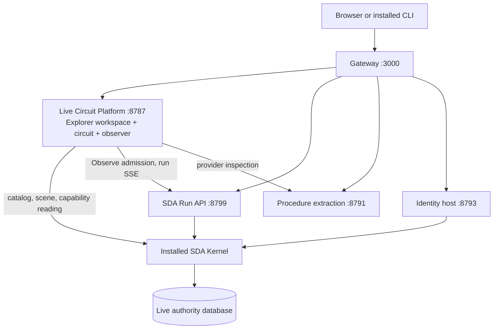

# SFX Live Circuit Platform: revamp plan

**New user decision, 2026-10-05:** staging deploys automatically on pushes to
`main`; this does not wait for P2 or a manually approved workflow. See
[automatic-staging-deployment.md](automatic-staging-deployment.md) for the
implementation and acceptance/rollback contract. This supersedes the manual
deployment choice in the historical dashboard below. P2 retains automatic
delivery while replacing overlay assembly.

**Accepted 2026-10-06, 01:03 UTC:** automatic
[run 37396070778](https://github.com/BPMSoftwareSolutions/sfx-platform/actions/runs/37396070778)
passed checks, Linux deployment/live acceptance, Windows CLI acceptance and
final confirmation. The current release is `circuit-e52b3eb246e8-37396070778-1`
(locked digest `bc94ae5f…`), with r15 retained as rollback. H2 is now served at
`/circuit/home`; `/` remains the inherited website. The installed kernel,
retrieval, identity and persistent vault are unchanged. The previously outstanding
replay, restart/vault and external CLI gates passed on this new release;
the [durable receipt](releases/staging-automation-2026-10-06.json) records them.

**P2 accepted 2026-10-06, 02:29 UTC.** Automatic
[run 37403470208](https://github.com/BPMSoftwareSolutions/sfx-platform/actions/runs/37403470208)
passed all four jobs (checks, Linux deployment and live acceptance, Windows CLI,
final confirmation). Staging runs `composite-e82d47d8a901-37403470208-1`, image
`558cc02e…`, built from `e82d47d` with no website; rollback is the overlay
release `54be0b60…`. Kernel `f50865d3…` (C#), retrieval, identity and the vault
are unchanged. After the run, `/` served the home page; `/capabilities`,
`/about` and `/sitemap.xml` answered 404; `/robots.txt` disallowed all.

**What P2 changed** (one composite image, no Next.js). Each push to
`main` now builds one image from the pinned Node base, copies the admitted
components from the bound image by digest and proves them byte-identical, and
places every host file and `live-circuit/` from the commit. The gateway no
longer starts the website: `/` serves the H2 home page, `/robots.txt` is the
gateway's own, and the website's routes answer 404. An ACR build-only preflight
against the current release passed (§4 P2), and the first composite release
passed the normal automatic workflow above.

**Next:** the Capability Explorer (P3 data path, then P4 workspace), starting
with the estate's P3 prerequisites (§6). Alongside: P0 credential custody in its
own window, P5 (remove the Next.js code and the now-unused overlay packagers),
and the remaining P1 local-observer cleanup.

Decided **2026-10-05**. This plan turns `sfx-platform` from a Next.js website
prototype plus a separately copied circuit into one product: the **SFX Live
Circuit Platform**, the Capability Explorer workspace around the existing Live
Circuit, built and released from this repository.

The UX direction is settled in the estate's
[Capability Explorer specification](https://github.com/BPMSoftwareSolutions/sfx-embody/blob/main/docs/research/coherence-conformance/capability-explorer-specification.md)
and [visual target](https://github.com/BPMSoftwareSolutions/sfx-embody/blob/main/docs/research/coherence-conformance/capability-explorer-visual-target.md).
The runtime topology is documented in
[live-circuit-staging-deployment.md](live-circuit-staging-deployment.md).
[Automatic staging releases](automatic-staging-deployment.md) owns normal
delivery now; P2 replaces image assembly while retaining that delivery policy.

## Historical baseline (2026-10-05, 23:30 UTC)

**Staging runs r15** (`sda-f50865d3feb4-r15`, image `b926002b…`), on the same C#
kernel (`f50865d3…`). Both r14 and r15 are locked in the registry; r14 is the
rollback target. The old Next.js website still answers `/`.

| Area | State | Evidence |
| --- | --- | --- |
| Website deploy guard (D3) | **Done** | `AZURE_STAGING_ENABLED=false`; `973b8f0` |
| P0 registry locking | **Done** for r14 and r15 (write and delete disabled) | ACR tag attributes |
| P0 credential custody | **Waiting on your go.** `SDA_API_TOKEN` and `SFX_IDENTITY_CONNECTION_STRING` are still direct, non-sticky settings; changing them restarts staging | Runbook §4 |
| P1 Move the Live Circuit | **Done, except** deleting the estate's old `demo/`. An observer started from it on October 2 still serves local port 8787 | `ce8b402`, `05007ef`; move acceptance receipt |
| Browser sign-in | **Released in r15.** Hosted checks passed at 22:31 UTC: real sign-in and cookie, wrong password refused, anonymous Observe refused, signed-in live Observe with providers visited and attribution, sign-out revocation, CLI login unchanged, no secrets in logs | `46098e1`; r15 evidence (not yet committed) |
| r15 close-out | **Open.** Replay at r15, a restart with the vault check, and external CLI visibility are not recorded. The receipt and runbook update are not committed | "Next" item 1 |
| Home page | **Designed and built, not released.** H1 (`1507752`), then H2 from another session; H2 implemented at `/circuit/home` with the sign-in page restyled to match (`0ca7388`) | [Home page design](home-page-design.md) |
| P2 One image without Next.js | **Accepted 2026-10-06** (`composite-e82d47d8a901-37403470208-1`) | §4 P2 |
| P3 Explorer data path | **Blocked** in the estate: DC-05a is paused, and a routing-law regression makes 11 capability readings fail | §6 |
| P4 Explorer workspace | **Not started** (needs P3) | §4 P4 |
| P5 Remove Next.js code | **Not started** (after P2) | §4 P5 |
| P6 Deployment evolution | **Started.** Observe requires sign-in; per-user authority inside the API, durable run history and production promotion remain | §4 P6 |

## Historical sequence before automatic delivery

1. **Close out r15.**
   - Run the hosted checks still outstanding:
     - replay at 1x and 0.1x;
     - a restart showing an unchanged vault fingerprint;
     - external CLI follow.
   - Commit the receipt as
     `deploy/sda-kernel/browser-session-acceptance-2026-10-05.json`, with the r15
     verification scripts (`tools/live-circuit/verify-*.mjs`).
   - Update the runbook: the route table says r15, plus the release record.
2. **Release r16** with the H2 home page (`/circuit/home`), the restyled sign-in
   page, and the kernel language in `/healthz`.
   - Path: the circuit overlay packager (`prepare-circuit.mjs`) on the locked r15
     digest.
   - Acceptance: both pages render their staging values (counts, C#, r15 or r16),
     signed out and signed in, and every r15 gate still passes.
3. **Choose a window for P0 credential custody.** It restarts staging once.
4. **P2:** build one composite image from this repository without Next.js. `/`
   then serves the home page, and the overlay packagers retire.
5. **Estate side, then P3 and P4:**
   - repair the routing-law NULL-terminal regression;
   - resume and install DC-05a (navigation);
   - add the kernel-invoked reading;
   - build the Explorer workspace.
6. **Housekeeping:** restart the local 8787 observer from `live-circuit/`, then
   delete the estate's `demo/` (P1 step 3).

The r15 release itself used the steps this section listed earlier:

- local launcher `d42a73c`;
- circuit overlay packager `1fef974`;
- r14 locked;
- r15 built, locked and bound by digest;
- hosted acceptance.

## 1. Decisions

| # | Decision | Consequence |
| --- | --- | --- |
| D1 | The Explorer and the Live Circuit live in `sfx-platform` | The generic viewer (`demo/circuit/`) and observer (`demo/dispatch-pair/observe-server.mjs`) move here verbatim. `sfx-embody` keeps database authority, inspect evidence and contracts |
| D2 | Next.js retires entirely | The platform app serves `/`. The website process, its static publication, media pipeline, second circuit renderer and `sidefx-database` CI dependency leave the image and the repository |
| D3 | The website-only deployment is disarmed before any push | Done 2026-10-05: repository variable `AZURE_STAGING_ENABLED=false` (21:11Z), and the `staging` job is removed from `.github/workflows/container.yml` |
| D4 | One circuit renderer | The Explorer surrounds the database-authored scene. No client re-draws capability meaning, and no second renderer is built |

## 2. Where things stand

| Concern | Today | Evidence |
| --- | --- | --- |
| Public product | The Live Circuit at `/circuit`, served by the observer on 8787 from estate files copied into the image | Runbook §1–2; `deploy/sda-kernel/prepare-identity.mjs` |
| Website | Next.js 16 on 3001, the gateway's default route. Pages render JSON published from a `sidefx-database` inventory dated 2026-09-08. Its own circuit renderer and workbench (`components/circuit`, `lib/run-graph.ts`, `lib/workbench`) are about 3,400 lines. Its navigation never links to `/circuit` | `README.md`; `generated/`; `components/shell/site-nav.tsx` |
| Circuit data | Kernel readers only: capability `list` and `read-live-scenario-circuit` | `circuit-host.json` (estate) |
| Explorer data | Not deployed. No hosted path serves `analysis.read_capability_details` or its navigation set; retrieval allows six provider/operation readers | Runbook §3; `retrieval-policy.json` |
| Image | `deploy/sda-kernel/Dockerfile` builds `FROM ${WEBSITE_IMAGE}`. Later releases are overlays on an exact previous digest; some assembly is manual | Runbook §6 |
| CI | `container.yml` builds and smoke-tests the website-only image (last five runs failed). Its deploy job is now removed | §1 D3 |

The circuit viewer is about 3,200 lines of dependency-free JavaScript
(`app.js`, `circuit-viewer.js`, `traversal.js`, `live-store.mjs`, `run-api.mjs`,
playback, observe panel and its `verify-*.mjs` acceptance scripts). It is the
part of today's system the Explorer must preserve.

## 3. Target

- **One app.** `/` opens the Explorer's estate entry (catalog). A capability opens
  the workspace: Explorer tree, capability header, tabs, summary cards, the
  circuit as the main canvas, context panel, and a status bar showing real host,
  observation and replay state.
- **Navigation is data.** Tree and tabs come from `capability_navigation` rows,
  the declared `capability-explorer-projection.v1` policy interpreted by the
  reading. Client code names no capability, scenario, provider, result set or
  section.
- **The circuit is unchanged.** Returned scene SVG, geometry, pagination, descent,
  Observe, SSE, traversal, replay clock, snapshot checks and stale-selection
  handling are reused as they are.
- **Scenario is a carried selection.** Each circuit is the selected scenario's own
  scene; operations are keyed by (`scenario_version_pk`, `ordinal`).

### Ownership after the move

| Repository | Owns |
| --- | --- |
| `sfx-platform` | Explorer and circuit code, observer, gateway, host policies, image build, release manifest and receipts, `tools/sfx-api` |
| `sfx-embody` | Database authority: capability rows, scene authority, the reading and its navigation policy, inspect evidence, migration lifecycle, data and playback contracts |
| SDA | Admitted kernel installation and SDA API build |
| `sfx-providers`, `sfx-dal` | Retrieval and identity executables and their generated DALs |

The platform consumes the estate through the installed kernel and the database,
never through a checkout at runtime. Development configuration that selects a
local estate and kernel is an explicit setting, not a sibling path.

## 4. Phases

Each phase ends with evidence, and nothing is released without the runbook's
acceptance gates.

### P0. Release safety (deploy guard and registry locks done; credential custody awaits a go)

Done: D3. Remaining Azure operator work, not done by this plan:

- make `SDA_API_TOKEN` and `SFX_IDENTITY_CONNECTION_STRING` slot-sticky Key Vault
  references;
- lock the r14 manifest and tag in ACR.

### P1. Move the Live Circuit here

1. Copy `demo/circuit/` and `demo/dispatch-pair/observe-server.mjs` from a named
   `sfx-embody` revision into `live-circuit/`. Record a move manifest: source
   revision, path, and SHA-256 per file. The copies must be byte-identical.
2. Point the packagers at `live-circuit/` instead of an `<estate-directory>`.
3. Remove `demo/` from `sfx-embody`. Its contract documents then cite the platform
   by repository, revision and path.

Acceptance: hashes match the manifest. Every existing `verify-*.mjs` passes
against a local installed kernel. Browser Observe, external CLI follow and replay
behave as before.

**Status 2026-10-05: steps 1 and 2 are done; step 3 is held.**

- `ce8b402` holds the verbatim copy: 32 files, no committed-blob mismatch.
- `05007ef` adds `SDA_ESTATE_DIR` and moves the packagers onto `live-circuit/`.
- The [move acceptance](../deploy/sda-kernel/live-circuit-move-acceptance-2026-10-05.json)
  records the evidence:
  - packaged files are equal across all three packagers;
  - observer reads match except `readAt` (350-entry catalog, two scenes);
  - 11 of 11 acceptance-script cases behave identically from both locations;
  - the run-scoped SSE check passes.

Browser Observe and replay were not exercised. Retained inputs no longer fit
eight of the script cases at either location.

Step 3 is held because an observer started from the estate's `demo/` on
October 2 still serves port 8787 and reads static files from disk. The estate
copy is frozen behind a notice (estate `87fdf42`), and its documents name
`live-circuit/`. To finish: restart local observers from this repository
(`SDA_ESTATE_DIR=<estate> node live-circuit/dispatch-pair/observe-server.mjs`),
then delete the estate's `demo/`.

### P2. One composite image from one repository, without Next.js

1. A new composite Dockerfile builds `FROM` a pinned Node runtime image by digest.
   It no longer uses `WEBSITE_IMAGE`.
2. Inputs: the admitted kernel installation (by digest), the SDA API build, the
   published retrieval and identity hosts with their DALs, host policies,
   `live-circuit/`, and the gateway. Vault bootstrap handling is unchanged.
3. The gateway stops launching the website. Port 3001 and its default route are
   removed, and `/` redirects to `/circuit` until P4 lands.
4. A single release script writes `/opt/sfx/release.json` with every component
   hash and source revision. It builds in ACR and locks the new tag and manifest.
5. CI builds and tests that composite image on pull requests and pushes. Pushes
   to `main` automatically bind staging and run acceptance/rollback through the
   release workflow. P2 replaces image assembly, not automatic delivery.

Acceptance: runbook §7 gates on staging, plus parity with r14 for circuit reads,
Observe, external runs, identity, retrieval, replay and restart. The overlay
packagers retire after the first complete release.

**As implemented (2026-10-06).** Files: `deploy/sda-kernel/Dockerfile.composite`,
`prepare-composite.mjs`, `component-fingerprint.sh`, `verify-composite-package.mjs`;
`deploy/staging/release.mjs` and `policy.mjs`; `gateway.mjs`. Three differences
from the steps above, each deliberate:

- **Components come from the bound exact image**, not from separately published
  inputs. The release already reads that image by digest; the build copies its
  kernel, SDA API build, retrieval and identity hosts with DALs, delivery
  configuration and vault bootstrap, and fingerprints each one (paths, contents,
  modes, symlinks) before and after the copy. Rebuilding those binaries stays an
  SDA-side release; the policy refuses any manifest whose binaries change.
- **`/` serves the home page** (H2, decided with the home page) instead of
  redirecting to `/circuit`. `/favicon.ico` is the emblem. `/robots.txt` disallows
  everything when `SIDEFX_INDEXING=disabled`. Every other former website path is a
  404 page linking home.
- **Pull requests run the packaging check**, not an image build. The image is
  built in ACR only on `main`, where it is locked and bound. The build itself
  refuses the image on any component or manifest mismatch, or if `/app` exists.

Preflight, before the first push: `az acr run` built the composite against
`circuit-b8f15c889fb6-37399599577-1` without pushing. Components were identical,
`/app` was absent, `ldd` found no missing libraries for `KernelEntry`,
`sfx-identity-host` or `procedure-extract`, and the observer served
`/circuit/home`, `/circuit/login`, `/circuit/site.css`, the emblem and
`/api/circuit/v1/home`. Public acceptance now also requires the home page at
`/`, 404 for `/capabilities`, `/about` and `/sitemap.xml`, and a disallow-all
`robots.txt`.

### P3. Explorer data path

1. Finish estate unit **DC-05a**: declare the navigation policy and add
   `capability_navigation` to `analysis.read_capability_details`. The migration
   pair is drafted and dry-run clean, but **not installed** (paused 2026-10-05; see
   §6).
2. Declare a reading capability that the kernel invokes, like
   `read-live-scenario-circuit`, and add it to `circuit-host.json` readers with
   the same timeouts, size cap, queueing and cache. This keeps one invocation
   path for CLI, API and UI.
3. Keep `analysis.compare_capability_story` (History) on demand.

The alternative, allowlisting the reading in retrieval, would tie every reading
change to DAL regeneration and a service release. The reading changes often, so
the kernel path is preferred.

Acceptance: the reading for the two workbook specimens and two multi-scenario
capabilities (8 and 20 scenarios) arrives within the 3-second warm-read bound.
Navigation rows match the estate's independent witness. A failed reading renders
as a visible failure, never as an empty workspace.

### P4. Explorer workspace (estate unit DC-06)

Build the shell from the visual target's regions:

- tree and tabs from navigation rows;
- scenario switcher;
- summary cards bound to intent, affordance and posture;
- context panel that follows the selection;
- expanded circuit state;
- drawers at narrow widths;
- status bar showing real state.

Tree, tab and canvas selection is one model. Moving between pages preserves the
selected run and replay position.

Acceptance: visual target §6 and the comprehension plan's acceptance cases
(data-driven navigation, policy coverage, findings keep sections visible,
multi-scenario, one navigation in live and replay). Check both specimens and a
multi-scenario capability at real browser sizes, with runtime states from real
captures.

### P5. Remove the Next.js estate

Delete the following from the repository:

- `app/`, `components/`, `lib/`, `content/`, `contracts/`, `generated/`;
- the publication and media scripts and the `public/media` pipeline;
- `next.config.ts`, the Next/React/Tailwind dependencies, the root `Dockerfile`;
- `container.yml` and the `sidefx-database` checkout.

Archive `website-design-spec.md` and `architecture.md` as historical, and keep
the decisions that still hold. Old routes answer 404, or redirect only where the
Explorer has a declared equivalent.

### P6. Deployment evolution

- Durable run, output, event and idempotency storage, so evidence survives
  restarts and releases.
- Per-user authorization before Observe stops being public staging behavior.
  Started 2026-10-05, unreleased:
  - browser sign-in at `/circuit/login` runs `authenticate-ide-user`;
  - Observe requires the resulting HttpOnly session, and each run is attributed
    to its principal ([browser session contract](live-circuit-browser-session.md)).

  Per-user authority inside the SDA API remains open.
- A production slot with swap-safe settings, and a promotion procedure.
- Health beyond startup: a scheduled real reading and invocation, recorded with
  the selected database generation.
- Multiple instances only after state is durable and coordinated.

## 5. Sequence

P0 → P1 → r15 (overlay: P1 and browser sign-in; released) → r16 (overlay: home page) → P2 → P3 → P4 → P5,
with P6 alongside. P2 already removes Next.js from the image, so P5 is only
repository cleanup. P3 and P4 depend on the estate:
DC-05a must be installed before the Explorer can read navigation.

## 6. Known blockers and risks

- **Reading regression.** Since 2026-10-05 11:27Z,
  `analysis.fv_routing_conformance` declares `@variants.terminal bit NOT NULL`.
  The law loads the root scenario's outcome variants, so the reading fails with
  error 515 wherever a root-scenario variant has `terminal` NULL. That is 11 of
  350 selected capabilities, including the 30-scenario
  `author-capability-scenario-conveyor`. Fifteen carry NULL-terminal variants in
  some scenario (165 rows). Source: estate migration
  `correct-v3-routing-and-terminal-law`. It needs an estate repair before the
  Explorer can show those capabilities.
- **DC-05a is paused.** Its draft migration pair
  (`declare-capability-navigation.sql`/`.commit.sql`) entered estate history
  through an unrelated commit (18c7c07) before acceptance. Do not run it until the
  unit resumes: its preflight harness needs a transaction check after every
  request, and its marker reporting has one open correction. The preflight's
  accidental residue was retired by estate commit 7440728.
- **Second-renderer drift.** Any Explorer view that redraws circuit topology from
  rows in the browser violates D4. Use the returned scene, or extend scene
  authority in the estate.
- **Database and image identities differ.** Each acceptance receipt records the
  selected reading, policy and scene definition digests alongside the image and
  kernel digests.
- **Local development.** After P1 the viewer runs from this repository against
  an explicitly configured kernel and estate configuration. Verify this before
  removing `demo/` from the estate.

## 7. Open questions

| Question | Needed by |
| --- | --- |
| Public legal, privacy and contact pages after Next.js: none on staging (noindex), or minimal static pages served by the platform? | Before any production promotion |
| Fate of `services/capability-api` (lab service with its own `package.json`) | P5 |
| Automatic staging deployment on `main` | Decided 2026-10-05; implemented by `staging.yml`; P2 retains it |
| Name of the Explorer route: keep `/circuit` deep links and serve the workspace at `/`, or introduce `/explorer`? | P4 |
