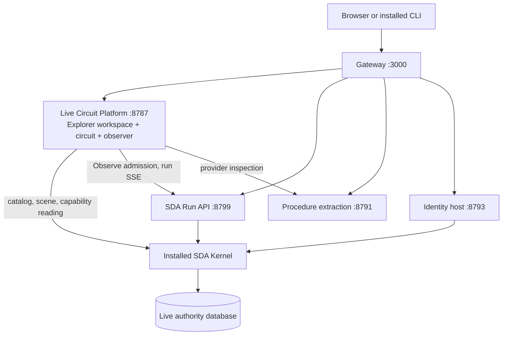

# SFX Live Circuit Platform: revamp plan

Decided **2026-10-05**. This plan turns `sfx-platform` from a Next.js website
prototype plus a separately copied circuit into one product: the **SFX Live
Circuit Platform**, the Capability Explorer workspace around the existing Live
Circuit, built and released from this repository.

The UX direction is settled in the estate's
[Capability Explorer specification](https://github.com/BPMSoftwareSolutions/sfx-embody/blob/main/docs/research/coherence-conformance/capability-explorer-specification.md)
and [visual target](https://github.com/BPMSoftwareSolutions/sfx-embody/blob/main/docs/research/coherence-conformance/capability-explorer-visual-target.md).
The current deployment is documented in
[live-circuit-staging-deployment.md](live-circuit-staging-deployment.md), which
stays authoritative for releases until phase P2 replaces its release path.

## Status at 2026-10-05, 22:30 EDT

Staging still runs **r14** (`sda-f50865d3feb4-r14`, image `273fe391…`, kernel
`f50865d3…`). It is unchanged by everything below; `/healthz` was re-read at the
time of writing.

| Item | State | Evidence |
| --- | --- | --- |
| D3 Deploy guard | **Done.** The push-triggered run had only the build-and-test job | `AZURE_STAGING_ENABLED=false` (21:11Z); `973b8f0` |
| P0 Credential custody | **Not started; needs a go.** `SDA_API_TOKEN` and `SFX_IDENTITY_CONNECTION_STRING` should move to slot-sticky Key Vault references. Changing them restarts staging | Runbook §4 |
| P0 Registry locking | **Not started; needs a go.** Lock the r14 tag and manifest, the rollback target for the next release | Runbook §7 |
| P1 Move the Live Circuit | **Steps 1 and 2 done; step 3 held** | §4 P1 status; move acceptance receipt |
| Browser sign-in | **Built, not released.** `/circuit/login` runs `authenticate-ide-user`; the session is an HttpOnly cookie; Observe requires it, and runs are attributed. 13 of 13 conformance checks pass. A real sign-in against staging's identity host **worked from a local observer** (user-confirmed, 2026-10-05) | `46098e1`; [browser session contract](live-circuit-browser-session.md) |
| Local Observe | **Available, not yet accepted.** A local SDA Run API (127.0.0.1:8799, the built API from the SDA checkout, the installed C# kernel `d0fe2b83…`) feeds the local observer (8788). The kernel command it launches returned `say-hello-world` correctly. The launcher is a scratch script, not yet committed | "Next" step 0 |
| P2–P5 | Not started. P3 waits on estate DC-05a and on the routing-law regression | §4, §6 |

## Next: release r15 to staging (sign-in and the moved circuit)

**Scope.** r15 is an overlay on the exact r14 digest. It carries only:

- `deploy/sda-kernel/gateway.mjs`: the two session POST routes and
  `SFX_IDENTITY_ENDPOINT` for the observer;
- `live-circuit/`: the moved viewer and observer, sign-in, and the Observe gate.

r14's `app.js` and `traversal.js` hashes equal the moved files, so the only
circuit difference is the sign-in work. The kernel, identity host, retrieval
service, database, vault and credentials are unchanged. The Next.js website
stays in this overlay; P2 removes it.

**Behavior change to accept first.** Observe on staging becomes sign-in only.
Anyone testing Observe needs an enrolled `sfx-ide-local` account. Scene and run
reads stay public.

Steps:

0. **Commit the local stack launcher** as a development tool. It starts a local
   Run API on the installed kernel and the observer, with a per-launch token. It
   takes the built SDA API path as an argument rather than embedding a checkout
   path.
1. **Overlay packager.** Add `deploy/sda-kernel/prepare-circuit.mjs` and
   `Dockerfile.circuit`. The packager writes `host/gateway.mjs` and the
   `live-circuit/` placement over `STAGING_IMAGE`, refuses a non-fresh directory,
   and writes `release.json` with the hashes of every placed circuit file and of
   the gateway. Verify it with stand-in inputs, as the move acceptance did. The
   existing identity and retrieval overlays need published binaries that r15 does
   not change.
2. **Optional P0 first.** Apply the Key Vault and stickiness change and the r14
   lock in their own window. r15's restart acceptance then also covers them.
   Otherwise, lock r14 before binding r15.
3. **Record the binding** (runbook §7): previous image
   `DOCKER|…@sha256:273fe391…`, nonsecret settings, release receipt and the
   selected database generations, all in a private release record.
4. **Build and lock.** `az acr build` with `STAGING_IMAGE=<r14 digest>` and
   release ID `sda-f50865d3feb4-r15`. Record the ACR run and digest, then set the
   tag and manifest `--write-enabled false --delete-enabled false`.
5. **Bind and restart** the staging slot only, by digest. Confirm the ARM binding
   afterwards.
6. **Acceptance.** Write the receipt as
   `deploy/sda-kernel/browser-session-acceptance-<date>.json`.

   | Gate | Required evidence |
   | --- | --- |
   | Startup | `/healthz` shows r15 and the unchanged kernel; all children start; no restart loop |
   | Public boundary | Catalog and scenes load without sign-in; anonymous `/v1/*` is 401; external `POST /events` is 405; other circuit POSTs are 405 |
   | Sign-in | A real enrolled account. The cookie has `HttpOnly`, `Secure`, `SameSite=Strict` and the `__Host-` prefix. The header shows the identifier. The `authenticate-ide-user` run is visible on its circuit. A wrong password gives `AUTHENTICATION_REJECTED` and no cookie |
   | Observe gate | Anonymous Observe is 401 `SIGN_IN_REQUIRED`, with no run admitted. Signed-in Observe passes the runbook's live-flow gate (payload, operations, ports and providers, exact outcome). `/api/circuit/v1/session/runs` lists the run |
   | Sign-out | `REVOKED`; the next Observe is 401; a revoked cookie is refused |
   | Unchanged paths | CLI `sfx login`/`whoami`/`logout`; external CLI follow; provider inspection; replay at 1x and 0.1x |
   | Secrets | No password or bearer in `az webapp log tail` output during sign-in and Observe |
   | Restart | The vault is preserved; a fresh sign-in and Observe succeed afterwards |

7. **Rollback.** Rebind the recorded r14 digest and restart. Sessions live in the
   identity database and are unaffected. r14 ignores the cookie, so Observe reverts
   to public.
8. **Close out.** Update the runbook (the route table's "Not in r14" becomes r15,
   and the release record) and this status table.

After r15: P2 (one composite image without Next.js) replaces the overlay path.
P3 and P4 follow once DC-05a installs in the estate.

## 1. Decisions

| # | Decision | Consequence |
| --- | --- | --- |
| D1 | The Explorer and the Live Circuit live in `sfx-platform` | The generic viewer (`demo/circuit/`) and observer (`demo/dispatch-pair/observe-server.mjs`) move here verbatim. `sfx-embody` keeps database authority, inspect evidence and contracts |
| D2 | Next.js retires entirely | The platform app serves `/`. The website process, its static publication, media pipeline, second circuit renderer and `sidefx-database` CI dependency leave the image and the repository |
| D3 | The website-only deployment is disarmed before any push | Done 2026-10-05: repository variable `AZURE_STAGING_ENABLED=false` (21:11Z), and the `staging` job is removed from `.github/workflows/container.yml` |
| D4 | One circuit renderer | The Explorer surrounds the database-authored scene. No client re-draws capability meaning, and no second renderer is built |

## 2. Where things stand

| Concern | Today | Evidence |
| --- | --- | --- |
| Public product | The Live Circuit at `/circuit`, served by the observer on 8787 from estate files copied into the image | Runbook §1–2; `deploy/sda-kernel/prepare-identity.mjs` |
| Website | Next.js 16 on 3001, the gateway's default route. Pages render JSON published from a `sidefx-database` inventory dated 2026-09-08. Its own circuit renderer and workbench (`components/circuit`, `lib/run-graph.ts`, `lib/workbench`) are about 3,400 lines. Its navigation never links to `/circuit` | `README.md`; `generated/`; `components/shell/site-nav.tsx` |
| Circuit data | Kernel readers only: capability `list` and `read-live-scenario-circuit` | `circuit-host.json` (estate) |
| Explorer data | Not deployed. No hosted path serves `analysis.read_capability_details` or its navigation set; retrieval allows six provider/operation readers | Runbook §3; `retrieval-policy.json` |
| Image | `deploy/sda-kernel/Dockerfile` builds `FROM ${WEBSITE_IMAGE}`. Later releases are overlays on an exact previous digest; some assembly is manual | Runbook §6 |
| CI | `container.yml` builds and smoke-tests the website-only image (last five runs failed). Its deploy job is now removed | §1 D3 |

The circuit viewer is about 3,200 lines of dependency-free JavaScript
(`app.js`, `circuit-viewer.js`, `traversal.js`, `live-store.mjs`, `run-api.mjs`,
playback, observe panel and its `verify-*.mjs` acceptance scripts). It is the
part of today's system the Explorer must preserve.

## 3. Target

- **One app.** `/` opens the Explorer's estate entry (catalog). A capability opens
  the workspace: Explorer tree, capability header, tabs, summary cards, the
  circuit as the main canvas, context panel, and a status bar showing real host,
  observation and replay state.
- **Navigation is data.** Tree and tabs come from `capability_navigation` rows,
  the declared `capability-explorer-projection.v1` policy interpreted by the
  reading. Client code names no capability, scenario, provider, result set or
  section.
- **The circuit is unchanged.** Returned scene SVG, geometry, pagination, descent,
  Observe, SSE, traversal, replay clock, snapshot checks and stale-selection
  handling are reused as they are.
- **Scenario is a carried selection.** Each circuit is the selected scenario's own
  scene; operations are keyed by (`scenario_version_pk`, `ordinal`).

### Ownership after the move

| Repository | Owns |
| --- | --- |
| `sfx-platform` | Explorer and circuit code, observer, gateway, host policies, image build, release manifest and receipts, `tools/sfx-api` |
| `sfx-embody` | Database authority: capability rows, scene authority, the reading and its navigation policy, inspect evidence, migration lifecycle, data and playback contracts |
| SDA | Admitted kernel installation and SDA API build |
| `sfx-providers`, `sfx-dal` | Retrieval and identity executables and their generated DALs |

The platform consumes the estate through the installed kernel and the database,
never through a checkout at runtime. Development configuration that selects a
local estate and kernel is an explicit setting, not a sibling path.

## 4. Phases

Each phase ends with evidence, and nothing is released without the runbook's
acceptance gates.

### P0. Release safety (deploy guard done; credential custody and registry lock await a go)

Done: D3. Remaining Azure operator work, not done by this plan:

- make `SDA_API_TOKEN` and `SFX_IDENTITY_CONNECTION_STRING` slot-sticky Key Vault
  references;
- lock the r14 manifest and tag in ACR.

### P1. Move the Live Circuit here

1. Copy `demo/circuit/` and `demo/dispatch-pair/observe-server.mjs` from a named
   `sfx-embody` revision into `live-circuit/`. Record a move manifest: source
   revision, path, and SHA-256 per file. The copies must be byte-identical.
2. Point the packagers at `live-circuit/` instead of an `<estate-directory>`.
3. Remove `demo/` from `sfx-embody`. Its contract documents then cite the platform
   by repository, revision and path.

Acceptance: hashes match the manifest. Every existing `verify-*.mjs` passes
against a local installed kernel. Browser Observe, external CLI follow and replay
behave as before.

**Status 2026-10-05: steps 1 and 2 are done; step 3 is held.**

- `ce8b402` holds the verbatim copy: 32 files, no committed-blob mismatch.
- `05007ef` adds `SDA_ESTATE_DIR` and moves the packagers onto `live-circuit/`.
- The [move acceptance](../deploy/sda-kernel/live-circuit-move-acceptance-2026-10-05.json)
  records the evidence:
  - packaged files are equal across all three packagers;
  - observer reads match except `readAt` (350-entry catalog, two scenes);
  - 11 of 11 acceptance-script cases behave identically from both locations;
  - the run-scoped SSE check passes.

Browser Observe and replay were not exercised. Retained inputs no longer fit
eight of the script cases at either location.

Step 3 is held because an observer started from the estate's `demo/` on
October 2 still serves port 8787 and reads static files from disk. The estate
copy is frozen behind a notice (estate `87fdf42`), and its documents name
`live-circuit/`. To finish: restart local observers from this repository
(`SDA_ESTATE_DIR=<estate> node live-circuit/dispatch-pair/observe-server.mjs`),
then delete the estate's `demo/`.

### P2. One composite image from one repository, without Next.js

1. A new composite Dockerfile builds `FROM` a pinned Node runtime image by digest.
   It no longer uses `WEBSITE_IMAGE`.
2. Inputs: the admitted kernel installation (by digest), the SDA API build, the
   published retrieval and identity hosts with their DALs, host policies,
   `live-circuit/`, and the gateway. Vault bootstrap handling is unchanged.
3. The gateway stops launching the website. Port 3001 and its default route are
   removed, and `/` redirects to `/circuit` until P4 lands.
4. A single release script writes `/opt/sfx/release.json` with every component
   hash and source revision. It builds in ACR and locks the new tag and manifest.
5. CI builds and tests that composite image on pull requests and pushes. It never
   binds a slot. Binding stays the runbook's operator step, or a separately
   approved manual workflow.

Acceptance: runbook §7 gates on staging, plus parity with r14 for circuit reads,
Observe, external runs, identity, retrieval, replay and restart. The overlay
packagers retire after the first complete release.

### P3. Explorer data path

1. Finish estate unit **DC-05a**: declare the navigation policy and add
   `capability_navigation` to `analysis.read_capability_details`. The migration
   pair is drafted and dry-run clean, but **not installed** (paused 2026-10-05; see
   §6).
2. Declare a reading capability that the kernel invokes, like
   `read-live-scenario-circuit`, and add it to `circuit-host.json` readers with
   the same timeouts, size cap, queueing and cache. This keeps one invocation
   path for CLI, API and UI.
3. Keep `analysis.compare_capability_story` (History) on demand.

The alternative, allowlisting the reading in retrieval, would tie every reading
change to DAL regeneration and a service release. The reading changes often, so
the kernel path is preferred.

Acceptance: the reading for the two workbook specimens and two multi-scenario
capabilities (8 and 20 scenarios) arrives within the 3-second warm-read bound.
Navigation rows match the estate's independent witness. A failed reading renders
as a visible failure, never as an empty workspace.

### P4. Explorer workspace (estate unit DC-06)

Build the shell from the visual target's regions:

- tree and tabs from navigation rows;
- scenario switcher;
- summary cards bound to intent, affordance and posture;
- context panel that follows the selection;
- expanded circuit state;
- drawers at narrow widths;
- status bar showing real state.

Tree, tab and canvas selection is one model. Moving between pages preserves the
selected run and replay position.

Acceptance: visual target §6 and the comprehension plan's acceptance cases
(data-driven navigation, policy coverage, findings keep sections visible,
multi-scenario, one navigation in live and replay). Check both specimens and a
multi-scenario capability at real browser sizes, with runtime states from real
captures.

### P5. Remove the Next.js estate

Delete the following from the repository:

- `app/`, `components/`, `lib/`, `content/`, `contracts/`, `generated/`;
- the publication and media scripts and the `public/media` pipeline;
- `next.config.ts`, the Next/React/Tailwind dependencies, the root `Dockerfile`;
- `container.yml` and the `sidefx-database` checkout.

Archive `website-design-spec.md` and `architecture.md` as historical, and keep
the decisions that still hold. Old routes answer 404, or redirect only where the
Explorer has a declared equivalent.

### P6. Deployment evolution

- Durable run, output, event and idempotency storage, so evidence survives
  restarts and releases.
- Per-user authorization before Observe stops being public staging behavior.
  Started 2026-10-05, unreleased:
  - browser sign-in at `/circuit/login` runs `authenticate-ide-user`;
  - Observe requires the resulting HttpOnly session, and each run is attributed
    to its principal ([browser session contract](live-circuit-browser-session.md)).

  Per-user authority inside the SDA API remains open.
- A production slot with swap-safe settings, and a promotion procedure.
- Health beyond startup: a scheduled real reading and invocation, recorded with
  the selected database generation.
- Multiple instances only after state is durable and coordinated.

## 5. Sequence

P0 → P1 → r15 (overlay release of P1 and browser sign-in) → P2 → P3 → P4 → P5,
with P6 alongside. P2 already removes Next.js from the image, so P5 is only
repository cleanup. P3 and P4 depend on the estate:
DC-05a must be installed before the Explorer can read navigation.

## 6. Known blockers and risks

- **Reading regression.** Since 2026-10-05 11:27Z,
  `analysis.fv_routing_conformance` declares `@variants.terminal bit NOT NULL`.
  The law loads the root scenario's outcome variants, so the reading fails with
  error 515 wherever a root-scenario variant has `terminal` NULL. That is 11 of
  350 selected capabilities, including the 30-scenario
  `author-capability-scenario-conveyor`. Fifteen carry NULL-terminal variants in
  some scenario (165 rows). Source: estate migration
  `correct-v3-routing-and-terminal-law`. It needs an estate repair before the
  Explorer can show those capabilities.
- **DC-05a is paused.** Its draft migration pair
  (`declare-capability-navigation.sql`/`.commit.sql`) entered estate history
  through an unrelated commit (18c7c07) before acceptance. Do not run it until the
  unit resumes: its preflight harness needs a transaction check after every
  request, and its marker reporting has one open correction. The preflight's
  accidental residue was retired by estate commit 7440728.
- **Second-renderer drift.** Any Explorer view that redraws circuit topology from
  rows in the browser violates D4. Use the returned scene, or extend scene
  authority in the estate.
- **Database and image identities differ.** Each acceptance receipt records the
  selected reading, policy and scene definition digests alongside the image and
  kernel digests.
- **Local development.** After P1 the viewer runs from this repository against
  an explicitly configured kernel and estate configuration. Verify this before
  removing `demo/` from the estate.

## 7. Open questions

| Question | Needed by |
| --- | --- |
| Public legal, privacy and contact pages after Next.js: none on staging (noindex), or minimal static pages served by the platform? | Before any production promotion |
| Fate of `services/capability-api` (lab service with its own `package.json`) | P5 |
| Deploy from CI by a manual approved workflow, or operator-only? | P2 |
| Name of the Explorer route: keep `/circuit` deep links and serve the workspace at `/`, or introduce `/explorer`? | P4 |
