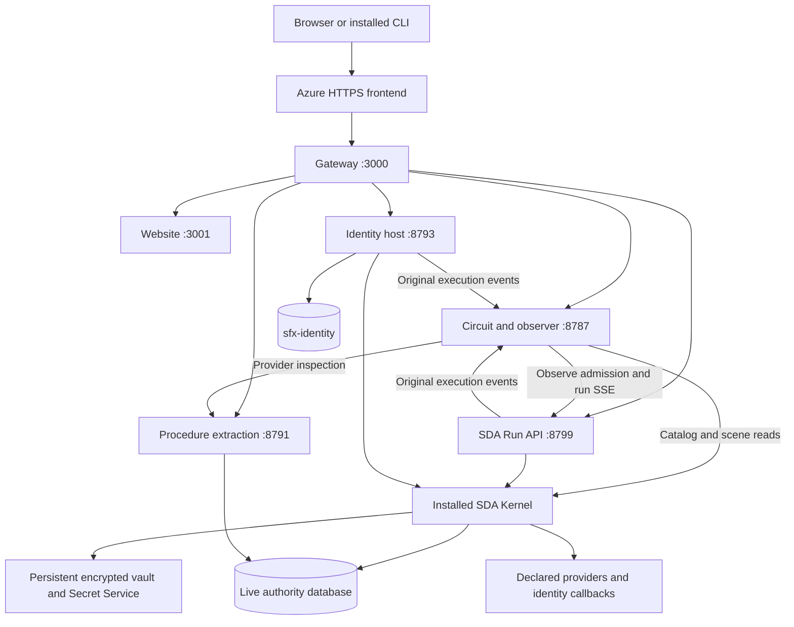

# SFX Live Circuit: sidefx/staging deployment strategy

**Release policy updated 2026-10-05:** circuit overlays now deploy automatically
on pushes to `main` through `.github/workflows/staging.yml`, with real browser,
CLI, replay, restart/vault gates and automatic rollback. See
[automatic-staging-deployment.md](automatic-staging-deployment.md) for the normal
delivery path. The r14 audit below is historical; its manual steps remain an
incident/full-runtime reference rather than a required operator procedure.

This is the operational runbook for the **composite Live Circuit deployment** at
<https://sidefx-staging-fyfhb9gubneqbpaz.eastus2-01.azurewebsites.net/circuit>.
It covers the website, observer, SDA Run API, installed kernel, procedure retrieval,
identity API, database authority and persistent credential vault as one deployment.

Audited **2026-10-05** against Azure slot configuration, ACR, GitHub workflow
configuration, the versioned host/packaging files, and deployment receipts.
Source baseline: platform commit `ef50b800eeb7da15a563df53da4da06c1c8879a5`.
The audit read configuration and public health; it did not redeploy, change
settings, rotate credentials, write database rows or rerun the acceptance suite.

The [older Azure guide](azure-deployment.md) describes the website build and
infrastructure bootstrap. It is **not** the complete-image release procedure.
The [host README](../deploy/sda-kernel/README.md) retains earlier release evidence.

## 1. Verified deployment and ownership

| Item | Observed value |
| --- | --- |
| Subscription | `878efc24-f06f-4255-83c0-2d38e71dc51c` |
| Tenant | `79f2fcb9-771e-4417-a9d9-4d7fa8f747d2` |
| Resource group / app / slot | `sidefx_group` / `sidefx` / `staging` |
| Platform | Linux, classic App Service `DOCKER\|` container configuration; East US 2 |
| Registry / image repository | `bpmaiengineacr.azurecr.io` / `sidefx/sfx-platform` |
| Live release / ACR build | `sda-f50865d3feb4-r14` / `ca5a` (Succeeded) |
| Live image | `bpmaiengineacr.azurecr.io/sidefx/sfx-platform@sha256:273fe3912c49fe3a3e7fc9dbf17519049486f733933483bbdf73297f414b5bbc` |
| Installed kernel | Linux C#, `sha256:f50865d3feb452a148ae02c3845296a1bf7f096551345108915005951e09127e` |
| Ingress / health | HTTPS only; minimum TLS 1.2; port 3000; Always On; `/readyz` |
| Storage / capacity | `WEBSITES_ENABLE_APP_SERVICE_STORAGE=true`; one configured worker |
| Indexing | `SIDEFX_INDEXING=disabled`; staging responses carry `noindex, nofollow` |
| Pull/secret identity | Staging slot's system-assigned identity, principal `fb93ffdc-8d7b-41b5-a65d-7891aaee2298` |

The live image binding, ACR output and `/healthz` agreed during this audit.
The complete component hashes and r14 acceptance scope are in
[the release receipt](../deploy/sda-kernel/provider-replay-acceptance-2026-10-05.json).
The release name identifies a deployed image; it does not pin the live database.

| Owner | Version-controlled responsibility | Deployed responsibility |
| --- | --- | --- |
| `sfx-platform` | `deploy/sda-kernel/`, `live-circuit/` (viewer and observer, moved from the estate on 2026-10-05), infrastructure, website, `tools/sfx-api/`, release receipts | Gateway, process supervision, packaged services, viewer/observer files placed at `/opt/sfx/estate/demo/`, HTTP CLI wrapper |
| `sfx-embody` | Database migrations/inspect evidence; data and playback contracts | Database-authored meaning, layout and scene authority |
| SDA | Kernel installation and SDA API build/interface authority | Admitted installed executable and compiled API files; no kernel checkout or runtime build |
| `sfx-providers` | `providers/procedure-extract/`, `providers/cli-login/host/` | Published Linux retrieval and identity executables |
| `sfx-dal` | Generation of DALs from installed database procedures | Published `SFX.DAL.dll` and `SFX.Identity.DAL.dll` carried with their services |
| Azure / database operator | Slot binding, identities, secret references, database migration admission | Persistent storage, managed access and live database state |

Build-time source inputs do not become runtime sibling-repository dependencies.
`sfx-embody` has no package install or build. Its execution delivery selects the
installed kernel through `/opt/sfx/estate/sfx.config.json` and the closed
`sfx-command-delivery.v1` envelope.

## 2. Process and request topology



The gateway is the only public container listener. Services bind to loopback.
Azure terminates public HTTPS; the internal proxy uses HTTP on loopback. Identity
provider callbacks use the declared HTTPS origin and dedicated service authority.
All these processes currently share one container and one restart boundary.
They need outbound access to the configured SQL services, declared HTTPS
providers, and the public identity callback origin. Image pull and Key Vault
reference resolution also need their Azure access paths. This audit did not
establish private endpoints, VNet isolation or new firewall rules; use the
configured database endpoints and test real reads rather than assuming those
network protections exist.

| Public surface | Internal destination | Authentication and behavior |
| --- | --- | --- |
| `/`, website routes | 3001 | Public website |
| `/circuit`, `/circuit/*`, circuit catalog/scenario/detail GETs | 8787 | Public database-backed viewer; no HTTP Basic prompt |
| `POST /api/circuit/v1/runs` | 8787, then 8799 | Same-origin JSON Observe transport; server adds its machine bearer. From the release carrying the [browser session](live-circuit-browser-session.md), it also requires a signed-in session |
| `/circuit/login`, `GET`/`POST /api/circuit/v1/session`, `POST /api/circuit/v1/session/logout` | 8787, then 8793 | Browser sign-in (`authenticate-ide-user`), status and sign-out. Same-origin JSON; HttpOnly `__Host-` cookie. Not in r14 |
| Run GETs under `/api/circuit/v1/runs/{id}` | 8787, then 8799 | Public circuit proxy for run status, graph, output and events |
| `/events` GET | 8787 | Public external-run SSE; gateway refuses public POST/event injection |
| `/v1/*` | 8799 | Direct SDA API validates caller's Bearer token; gateway forwards it unchanged |
| `/procedure-extract/json`, `/procedure-extract/excel` POST | 8791 | Gateway requires machine bearer; service allows only declared read procedures |
| Exact `/auth/*` routes | 8793 | Identity host applies login/session/operator/service credential rules |
| `/readyz`, `/healthz` | Gateway itself | Public release ID, kernel digest and supervisor readiness |

**Public Observe is a deliberate staging policy.** It is not protected by user
login. Same-origin checks constrain browser requests; they are not authentication
or per-user authorization. Run IDs are not an authorization boundary, and public
run/observer reads must be treated as public evidence. Direct `/v1/*` being
authenticated does not make the circuit's delegated invocation private.
The gateway never returns the server token to browser JavaScript.

Identity routes and capability/contract selection are in
[`identity-policy.json`](../deploy/sda-kernel/identity-policy.json).
Login uses an enrolled identifier and hidden password. Session and logout use the
user session; enrollment uses an operator token; provider callbacks use a separate
service key and a bounded, ordered private context. Passwords belong in the CLI's
private identity ingress, **never the generic circuit JSON editor**.
User login does not currently authorize its session bearer for `/v1/runs`.
See [login](../deploy/sda-kernel/identity-login.md),
[enrollment](../deploy/sda-kernel/identity-enrollment.md), and
[wrapper architecture](sfx-api-wrapper-architecture.md) for exact client commands.

## 3. Database authority and observation

The catalog and selected scene are read through the installed kernel using
`circuit-host.json`: capability listing and `read-live-scenario-circuit`.
The database supplies scenario identity, contracts, operations, bindings,
providers, outcomes, SVG geometry, navigation and observation mapping. A browser
refresh does not regenerate a PowerPoint file. Exported decks are a historical
view; they are not required to run the hosted circuit.

Provider drill-down additionally uses the generated-DAL retrieval API.
[`retrieval-policy.json`](../deploy/sda-kernel/retrieval-policy.json) currently
allows six procedures: `analysis.read_provider_canonical_body`,
`analysis.read_provider_details`, `analysis.read_provider_bindings`,
`analysis.read_provider_ports`, `analysis.read_capability_operations`, and
`analysis.read_capability_providers`. The inspector validates the selected
provider and snapshot digest; stale selection returns 409. Installing a procedure
alone does not regenerate an already deployed DLL or extend this allowlist.
Procedure changes therefore require DAL regeneration/service publication when
their generated interface changes, and an explicit policy change when exposing
a new reader. The service is not arbitrary SQL execution or an authoring API.

Database and image releases are independent:

- A row migration can change capability execution or rendering immediately,
  without an image deployment. Circuit cache expiry is 30 seconds; **Refresh from
  database** bypasses a completed cache entry.
- A viewer/host release changes deployed files. An installed kernel replacement
  changes the selected interpreter. Neither automatically changes database rows.
- Record both selected database definition digests/generations and image/kernel
  identity in acceptance evidence. A Git revision or green host check alone
  cannot establish that the selected database generation still executes.
- Estate changes follow its migration pair, transaction preflight, install and
  real invocation lifecycle. Use installed writers and base-table PK/FK evidence;
  new view/function references must follow the `fv_` convention. A deployment is
  not permission to reinstall an old SQL reader from a file over live authority.

The submitting browser follows its admitted run ID, captured graph and event
cursor directly through the API. The API's observation bridge forwards original
events in received order to the observer for external CLI viewers. Identity
execution publishes its own real kernel observations there. Reader diagnostics
are kept off the subject's event stream. **Follow external runs** and **Return
to live** are needed when watching a separate terminal execution.

Only matching testimony lights a component; declaration is not execution.
Payload entry, sequential operations, port/provider request and return, called
scenarios, and the exact root outcome must be checked while the run is active.
Unknown/mismatched return testimony remains a defect rather than illuminating a
convenient declared success. Provider timing does not separately measure network
transit when the capture supplies only an executor interval.

Replay uses the scenario's captured entry-to-return clock. **Normal 1x** preserves
those intervals; **Slow 0.1x** takes ten times the same scenario duration.
**Trace startup, database connection, session setup, authority reads and graph
preparation are excluded.** Browser frame scheduling is measured separately.
A replay acceptance cannot stand in for live provider-entry/return acceptance.

## 4. Configuration, credentials and persistent state

The slot's managed identity has `AcrPull` on the registry and `Key Vault Secrets
User` on the three named secret resources below. The configured ACR pull path
uses managed identity. Legacy registry username/password setting names also
remain present; this audit did not inspect their values or remove them.

| Setting | Observed storage / sticky status | Consumer |
| --- | --- | --- |
| `SDA_API_TOKEN` | Direct app setting; **not sticky** | SDA API, server-side Observe/website, retrieval gateway, enrollment operator admission |
| `SFX_IDENTITY_CONNECTION_STRING` | Direct app setting; **not sticky** | Identity host only, for `sfx-identity` |
| `PROCEDURE_EXTRACT_CONNECTION_STRING` | Resolved Key Vault reference; sticky; `sidefx-staging-procedure-extract-database` | Retrieval host as `sidefx-connection-string` |
| `SFX_VAULT_UNLOCK` | Resolved Key Vault reference; sticky; `sidefx-staging-sda-vault-unlock` | Keyring startup only |
| `SFX_IDENTITY_SERVICE_KEY` | Resolved Key Vault reference; sticky; `sidefx-staging-identity-service-key` | Identity host and matching encrypted kernel vault credential |
| `SDA_API_ENDPOINT` | Sticky server setting | Website configuration; gateway explicitly sets website/observer loopback endpoint |
| `WEBSITES_ENABLE_APP_SERVICE_STORAGE` | Sticky; `true` | Persistent `/home` |
| `WEBSITES_PORT`, `PORT` | Container ingress 3000 | Azure routing / gateway |
| `SIDEFX_INDEXING` | Sticky; `disabled` | Staging indexing policy |
| `WEBSITE_WARMUP_PATH`, `WEBSITE_WARMUP_STATUSES` | `/readyz`, `200` | Container warm-up |

The Key Vault is `aiengine-kv-20260406`. Secret names and identity IDs are
configuration metadata; **secret values never belong in Git, receipts, build
arguments, browser storage or screenshots**. Do not describe all settings as
Key Vault-backed or slot-sticky: the table records the observed differences.

The gateway captures retrieval/identity credentials and removes them from its
inherited environment before launching unrelated children. The vault unlock is
removed before child launch. API execution children have API authentication and
managed-identity header secrets stripped; observer reader children have API
tokens stripped. The identity host privately holds credentials and starts kernel
execution without them. Database boot and ordinary provider credentials for the
kernel come from its declared vault, not a SQL connection environment fallback.

### Vault startup and recovery

[`initialize.sh`](../deploy/sda-kernel/initialize.sh) creates `/home/sjones`, sets
ownership/mode, and drops to user `node` with explicit `HOME` and `XDG_DATA_HOME`.
The vault/keyring live under `/home/sjones/.local/share`. These paths must agree
with the installed kernel's credential locator. Using a different home changes
the vault identity; it is not a harmless container cleanup.

`/opt/sfx/vault-bootstrap.tar.gz` contains encrypted vault records, key-reference
records and the encrypted Secret Service keyring, with paths relative to that
data root. It contains **no unlock password**. `prepare.mjs` does not produce or
provision this archive; initial deployment requires a separately verified Linux
vault bootstrap. The current release inherits the admitted bundle from its base.
No plaintext credential bundle is added to a Docker build context.

On first start only, when `sfx/vault/vault.json` is absent, the host restores the
encrypted bootstrap. Later restarts use the persisted vault. It starts a session
D-Bus and a foreground, supervised `gnome-keyring-daemon`, supplies the unlock
through stdin, and probes the matching master key without logging it. Runtime
sockets use `/tmp`, because App Service's `/home` share cannot host Unix sockets.

For restart/recovery, preserve **both** encrypted vault and matching keyring/key
references, the unlock secret, and the same locator. Back up an access-controlled,
consistent set before intentional credential changes. An old bootstrap is not a
backup of later credentials. Do not delete `/home` to fix a failed unlock or
overwrite a current vault with the image's initial archive. Partial restoration
requires operator recovery; startup does not repair an existing broken vault.
Identity key rotation must coordinate the host secret and encrypted callback
credential; rotating one alone breaks authentication between provider and host.
The prior identity provisioning procedure and ETag checks are described in
[identity-login.md](../deploy/sda-kernel/identity-login.md).

### What survives a restart

| State | Durability |
| --- | --- |
| Database capability definitions and identity records | External databases; not reversed by image rollback |
| Encrypted vault and keyring | Persistent `/home`; retained across image changes |
| Gateway, website, viewer, kernel and service binaries | Exact container image; `/opt/sfx/release.json` identifies packaged components |
| SDA run records, outputs, idempotency map and event buffers | Process memory; restart loses them |
| Observer ring and scene cache | Process memory; restart loses them |
| Identity request contexts | Short-lived private host state; do not expect in-flight login/enrollment to survive restart |

Archive required run/graph/output/SSE evidence before a release. A lost connection
does not prove cancellation or that an invocation had no effects. Reconcile the
run and database outcome before retrying after restart; idempotency retention is
not durable across process loss. This deployment has no verified scale-out or
cross-instance event, run-state or file-vault coordination.

## 5. Startup, readiness and operating bounds

[`gateway.mjs`](../deploy/sda-kernel/gateway.mjs) checks required configuration,
restores/unlocks the vault, then launches retrieval and observer, identity, SDA
API, and website. It waits for each service before exposing the public listener.
The API readiness probe is an authenticated lookup of a nonexistent run, expected
to return 404; it proves the HTTP/auth path is responding, not business success.
Any supervised child error/exit terminates the composite host. An observation
bridge failure also exits the API rather than leaving missing evidence silent.

Public `/readyz` and `/healthz` both report gateway state, release ID and kernel
digest. After startup, they do **not** repeatedly execute SQL, inspect every
child, test all providers or validate capability results. The website's separate
internal `/readyz` checks its publication at startup. Do not apply the older
website-only health semantics to the public composite gateway.

| Bound | Current packaged configuration |
| --- | --- |
| Circuit reads | 2 active, 32 queued; 30-second read timeout; 16 MiB response cap |
| Scene cache | 24 entries, 32 MiB total, 30-second TTL |
| Browser Observe request | 1 MiB; proxy lifetime 630 seconds |
| SDA execution | Packaged API default 300-second run timeout; gateway sets 16 MiB output cap |
| SDA evidence | Gateway sets 20,000 events per run; packaged default 200 retained runs |
| Generic observer | 2,000-record rolling buffer; not a durable trace archive |

The 630-second browser proxy timeout does not extend the kernel run timeout.
Large/long runs can outlive retained observer history. Live viewers must connect
before execution, and acceptance must detect missing testimony rather than fill
gaps. These are code/policy bounds, not load-test or multi-tenant capacity claims.

## 6. Prepare a complete release

Run platform build/release commands from the **sfx-platform** workspace, not the
estate. Use a fresh staging directory. Keep credentials, local machine config
and private captures out of its build context. Retain a manifest of source
revisions, copied file hashes, installed kernel digest, service/DAL hashes,
policy files, previous release and exact base image.

There are two different paths today:

| Path | What it produces | Use for Live Circuit |
| --- | --- | --- |
| Root Dockerfile and `.github/workflows/container.yml` | Website-only image | A base-image build; **not** a replacement for the complete live slot |
| `deploy/sda-kernel/` packagers plus ACR build | Composite image or overlay on an exact composite digest | Current Live Circuit release method |

**The website-only deployment is disarmed (2026-10-05).** On audit, the
repository variable `AZURE_STAGING_ENABLED` was `true`, and `container.yml`
patched this same slot after a successful non-PR build on its admitted branches.
A successful run could have replaced the complete host with a website-only image.
The variable was set to `false` at 21:11Z, and the `staging` job was removed from
the workflow, which now only builds and tests the website image. Neither the
website image nor that workflow is a Live Circuit release path. Both retire with
Next.js under the [platform revamp](live-circuit-platform-revamp.md).

### Packaging choices

1. **New website/kernel/API foundation:** obtain an admitted, tested Linux kernel
   installation and built SDA API. On Linux, preserving symlinks and executable
   permissions, run:

   ```text
   node deploy/sda-kernel/prepare.mjs <installed-root> <sda-api-source> <fresh-context>
   ```

   Its Dockerfile takes `WEBSITE_IMAGE=<exact website digest>`. It archives the
   installed kernel and copies built API/interface/schema files, this repository's
   `live-circuit/` viewer and observer, and a Linux delivery configuration. It does not install database rows,
   generate DALs, provision credentials or by itself assemble all later services.
   Current gateway startup also requires retrieval, identity, their policies and
   the encrypted vault bootstrap. Assemble those before treating a new foundation
   as a runnable candidate; do not deploy an intermediate layer.

2. **Retrieval/DAL update:** publish `procedure-extract` for `linux-x64`, Release,
   self-contained, with the regenerated `SFX.DAL.dll`, then:

   ```text
   node deploy/sda-kernel/prepare-retrieval.mjs <published-directory> <previous-release.json> <fresh-context> <new-release-id> [--with-circuit]
   ```

   Build `Dockerfile.retrieval` with `STAGING_IMAGE=<exact previous composite
   digest>`. `--with-circuit` also copies `app.js`, `live-store.mjs` and
   `circuit-host.json` from `live-circuit/circuit/`; it is **not** a full viewer refresh.

3. **Identity or full circuit/observer update:** publish the identity host's
   `LoginHost.csproj` for `linux-x64`, Release, self-contained, with its generated
   `SFX.Identity.DAL.dll`, then:

   ```text
   node deploy/sda-kernel/prepare-identity.mjs <published-host> <previous-release.json> <fresh-context> <new-release-id>
   ```

   This copies the full `live-circuit/` circuit directory and observer, plus identity host and
   policy, over `STAGING_IMAGE=<exact previous composite digest>`. It preserves
   the inherited installed delivery configuration and retrieval service. Never
   copy a Windows developer's `sfx.config.json` over the Linux configuration.
   All three packagers place `live-circuit/` through `deploy/sda-kernel/live-circuit.mjs`
   and refuse the retired estate-directory argument. The image layout is unchanged.
   The move is recorded in [the move acceptance](../deploy/sda-kernel/live-circuit-move-acceptance-2026-10-05.json).

Packagers require a fresh destination and write `/opt/sfx/release.json`. An
overlay must preserve inherited services and deliberately replace only its
reviewed files. The r14 replay update used a bounded circuit overlay and recorded
app/traversal hashes in its receipt; there is no dedicated general-purpose
circuit-only packager or single complete-image CI pipeline today. Retain any
release-specific assembly instructions with its receipt rather than implying a
temporary staging directory is a durable build system.

The selected interpreter remains C#. Earlier Linux Node install/Hello World
checks passed, but the October 1 release evidence records incompatible pinned
Unicode digests for some applications. Do not switch language merely because the
HTTP host runs Node, or bypass digest admission to make a deployment start.

## 7. Build, bind and verify staging

This is an operator-run procedure, **not executed by this documentation update**.
Resolve all placeholders, coordinate the website deployment job, and preserve
the previous binding before changing anything. Commands below use PowerShell;
check `$LASTEXITCODE` after native commands. No production slot swap is involved.

### Record the current binding

```powershell
$binding = Get-Content infra/azure.json -Raw | ConvertFrom-Json
$slotUrl = "https://management.azure.com/subscriptions/$($binding.subscriptionId)/resourceGroups/$($binding.resourceGroup)/providers/Microsoft.Web/sites/$($binding.appName)/slots/$($binding.stagingSlot)"
$configUrl = "${slotUrl}/config/web?api-version=$($binding.appServiceApiVersion)"
$previousImage = az rest --method get --url $configUrl --query properties.linuxFxVersion -o tsv
if ($LASTEXITCODE -ne 0 -or $previousImage -notmatch '^DOCKER\|.+@sha256:[a-f0-9]{64}$') { throw 'Exact prior image required' }
$previousImage | Set-Content -Encoding utf8 '<private-release-record>/previous-image.txt'
```

Also record the prior nonsecret settings, Key Vault reference identities, release
receipt and database migration/generation identities. Store any secret-bearing
configuration backup privately; do not dump appsettings into a Git receipt.

### Build and select an immutable image

```powershell
$releaseId = '<new-unique-release-id>'
$context = '<prepared-complete-overlay-context>'
$baseImage = $previousImage.Substring('DOCKER|'.Length)
az acr build --registry $binding.registryName --image "$($binding.imageRepository):$releaseId" --build-arg "STAGING_IMAGE=$baseImage" $context
if ($LASTEXITCODE -ne 0) { throw 'ACR build failed' }
$digest = az acr repository show -n $binding.registryName --image "$($binding.imageRepository):$releaseId" --query digest -o tsv
if ($LASTEXITCODE -ne 0 -or $digest -notmatch '^sha256:[a-f0-9]{64}$') { throw 'Image digest missing' }
$image = "$($binding.registryServer)/$($binding.imageRepository)@$digest"
```

For a new foundation use `WEBSITE_IMAGE`, not `STAGING_IMAGE`, with the matching
Dockerfile and all required services assembled. Record the ACR run ID/output
digest and verify the final Linux image and release manifest. Do not use `latest`
or an unverified rebuild during promotion. The r14 manifest is digest-selected
but ACR reported `writeEnabled=true` and `deleteEnabled=true` on audit: **registry
locking is not currently established for that manual release**. If release
retention policy locks the new tag/manifest, use `az acr repository update` with
`--write-enabled false --delete-enabled false`, and verify/record the result.

### Bind only the staging slot

```powershell
$patchFile = '<private-release-record>/container-binding.json'
@{ properties = @{ linuxFxVersion = "DOCKER|$image" } } | ConvertTo-Json | Set-Content -Encoding utf8 $patchFile
az rest --method patch --url $configUrl --body "@$patchFile" -o none
if ($LASTEXITCODE -ne 0) { throw 'Slot binding failed' }
az rest --method post --url "${slotUrl}/restart?api-version=$($binding.appServiceApiVersion)" -o none
if ($LASTEXITCODE -ne 0) { throw 'Restart failed' }
```

Patch the slot's `config/web` resource, not production or a tag alias. Use the
deployment principal's scoped Azure permissions; it does not need a registry
admin password. Confirm the ARM binding still equals `DOCKER|$image` after checks.

### Acceptance gates

| Check | Required evidence |
| --- | --- |
| Startup | `/healthz` and `/readyz` return the intended release/kernel; ARM reports the exact image; all child services start without restart loops |
| Public/read boundary | Clean browser loads website/circuit without Basic challenge; anonymous direct `/v1/*` is 401; external event POST is 405 |
| Database retrieval | Capability count paired with list, two different scenarios, provider drill-down, matching snapshot/definition digests; stale selection and disallowed procedures refused |
| Real browser Observe | Fresh valid contract payload, one admitted run, graph and output captured; sequential input-to-operation-to-port/provider-to-exact-outcome flow while live |
| External CLI | Open circuit before `sfx-api capability observe ... --json --trace`; verify external run selection and provider visits before return/process exit |
| Identity, if changed | Installed CLI enrollment/login/whoami/logout with disposable acceptance identities; private fields absent from observer; private callbacks reject wrong authority |
| Replay | Replay the same captured run at 1x and 0.1x; compare measured duration with scenario timestamps; verify provider-child intervals, pause/step/resume and exact outcome |
| Restart | Preserve vault ciphertext, restart, verify service health and a fresh real invocation; do not expect old in-memory runs to remain |

Capture input shape (without private credentials), run ID, graph identity, actual
outcome/errors, event completeness, selected authority generations, browser
errors, timing deviations and hashes. An HTTP 200, exit code 0, or `ready:true`
is not by itself capability success. `CELL_EXECUTION_FAILED` and unknown outcome
testimony must fail that acceptance even if the container is healthy.
Native PowerShell 5.1 JSON/stderr capture should go through `cmd /c`, as required
by the estate's invocation instructions.

The r14 receipt proves its stated replay/provider timing checks, including an
unchanged retained capture; it explicitly does not claim a fresh user login.
Earlier [Observe](../deploy/sda-kernel/circuit-observe-acceptance-2026-10-01.json),
[retrieval](../deploy/sda-kernel/retrieval-acceptance-2026-10-02.json),
[login](../deploy/sda-kernel/identity-acceptance-2026-10-04.json), and
[enrollment](../deploy/sda-kernel/identity-enrollment-acceptance-2026-10-04.json)
receipts establish their dated, bounded checks. They are not perpetual acceptance
of every database capability. The separate October 5 v3 null-reference
investigation in the estate is an example of a database-generation regression
under a healthy unchanged kernel.

## 8. Rollback and incident diagnosis

To roll back a container, load the **recorded previous full `DOCKER|...@sha256`**
binding into the same patch structure above and restart the same staging slot.
Do not guess the previous release from a tag. Verify health, live reads and a
fresh invocation against the restored image. Preserve `/home`, vault/keyring,
Azure secret references and both databases. A previous website-only image or
temporary tunnel is not a functional fallback for this composite host.

With `$binding`, `$slotUrl` and `$configUrl` established as in section 7:

```powershell
$recordedPrevious = (Get-Content '<private-release-record>/previous-image.txt' -Raw).Trim()
if ($recordedPrevious -notmatch '^DOCKER\|.+@sha256:[a-f0-9]{64}$') { throw 'Invalid rollback binding' }
$rollbackFile = '<private-release-record>/rollback-binding.json'
@{ properties = @{ linuxFxVersion = $recordedPrevious } } | ConvertTo-Json | Set-Content -Encoding utf8 $rollbackFile
az rest --method patch --url $configUrl --body "@$rollbackFile" -o none
if ($LASTEXITCODE -ne 0) { throw 'Rollback binding failed' }
az rest --method post --url "${slotUrl}/restart?api-version=$($binding.appServiceApiVersion)" -o none
if ($LASTEXITCODE -ne 0) { throw 'Rollback restart failed' }
```

Container rollback does not undo database migrations, completed invocations,
enrollments or credential rotations. For a database regression, compare the
selected rows and retained working generation, then author/preflight a repair
through the estate lifecycle. Do not reinstall stale reader text merely because
it is in Git. A secret rollback needs a coordinated credential recovery, not an
image change. Retain rollback evidence and its limits separately from deployment
success.

| Symptom | First boundary to inspect |
| --- | --- |
| `/circuit` disappears after a release | ARM image digest and website-only workflow deployment history |
| Warm-up fails / restart loop | Gateway startup output, required settings, Key Vault reference resolution, child exit, `/home` ownership and master-key probe |
| Browser username/password popup | Unexpected Basic gate or upstream replacement; current host does not issue that challenge |
| Direct API 401 | Caller machine bearer vs configured token; do not confuse it with a login session or provider callback key |
| Catalog/scene read fails | Installed delivery config, vault database credential, selected reader authority and read bounds |
| Provider inspection 409/403 | Stale snapshot/provider selection or retrieval allowlist, respectively |
| Run has no live provider dot | Full trace availability, run/graph selection, declaration-to-receipt identities, missing/late intervals and observer retention |
| Replay timing differs | Scenario entry/return and provider-child capture timestamps vs browser wall clock; do not add invented delay |
| `IDENTITY_UNAVAILABLE` | Identity connection, declared callback origin, matching service key in host/vault, real private-host failure evidence |
| `CELL_EXECUTION_FAILED` under healthy host | Output and failing cell/child graph, selected DB generation vs known-working generation; image/kernel history independently |

Read-only Azure diagnostics can use `az webapp show`, `az rest .../config/web`,
`az webapp log tail`, ACR run metadata and Git history. Never publish an unfiltered
appsettings/log dump: retrieve only required metadata and redact private input.
Database evidence should use the estate's inspect sets, base tables and PK/FK
joins. Preserve failing captures before retrying or restarting.

## 9. Explicit limits and next release work

This is a working **single-instance staging composition**, not a claim of
production or high-availability readiness. Remaining work visible in this audit:

- Replace the overlay packagers with one complete-image build from this repository
  (the website-only deploy job is removed; see the
  [platform revamp](live-circuit-platform-revamp.md), phase P2).
- Preserve an automated complete-image assembly/release manifest; current overlays
  and receipts are versioned, but some release-specific assembly is manual.
- Make API token and identity connection custody/slot behavior intentional before
  any swap; they are currently direct, non-sticky app settings.
- Establish registry retention/locking for manual releases and a tested,
  access-controlled vault backup/restore procedure. Restart acceptance is not a
  disaster-recovery test.
- Add durable run/evidence/idempotency storage and verified multi-instance
  coordination before scaling out; increasing the worker count alone is unsafe.
- Define per-user capability/run authorization before treating the public demo
  as a private IDE; login/session implementation alone does not provide it.
- Re-verify database/provider generations and the business flows changed by each
  release. Native macOS identity acceptance and full formal observability remain
  outside the cited Windows/hosted functional receipts.

Production promotion is a separate operation. There is no automatic swap in the
current composite procedure, and this document authorizes none. Update this
runbook and retain a new acceptance receipt whenever routes, packaged services,
credentials, persistence, limits or the release path change.
