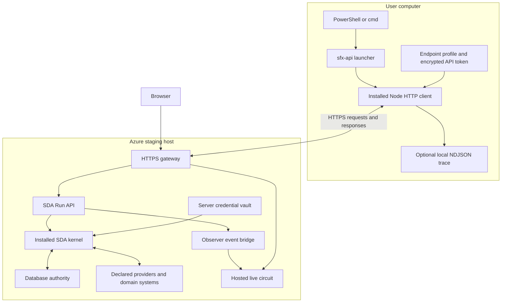

# sfx-api wrapper architecture

Implementation reviewed on October 1, 2026.

`sfx-api` gives the SDA Kernel API a command-line entry point. It translates a
command into an HTTP submission, waits for the remote run, and prints the
scenario's returned JSON. Capability meaning, provider selection, execution and
outcome decisions remain with database authority and the installed remote kernel.

The wrapper is platform transport code. Its source lives in
[`tools/sfx-api`](../tools/sfx-api/README.md), and its installed copy runs outside
the repository. Calling it from `C:\lab\repos\sfx-embody` does not add a runtime,
package manifest, database connection or source dependency to that estate.

## Command and result

The installed command accepts:

```powershell
sfx-api capability observe request-capability-from-objective-v3 --input "What is Broadcom's current market price?" --json --trace
```

The capability identity and input are arguments. The wrapper contains no routing
branch or provider knowledge specific to this example.

It sends this body to `POST /v1/runs` with Bearer authentication:

```json
{
  "object": "capability",
  "operation": "observe",
  "subject": "request-capability-from-objective-v3",
  "input": "What is Broadcom's current market price?"
}
```

The API immediately returns a run resource with HTTP `202` and a `runId`.
The wrapper waits for completion and retrieves `/v1/runs/{runId}/output`.
It parses that JSON and writes it as one compact line to stdout, preserving its
values without adding a client envelope. `--json` makes the requested format
explicit; JSON is also the current default when the flag is omitted.

## Deployment topology



The current staging endpoint is
[SideFX staging](https://sidefx-staging-fyfhb9gubneqbpaz.eastus2-01.azurewebsites.net/).
The endpoint is profile data, not a constant in the client.

The gateway receives public HTTPS traffic and routes `/v1/` to the SDA API on
internal port `8799`. The observer uses internal port `8787`; the website uses
`3001`; the gateway listens on `3000` behind Azure's HTTPS front end. The gateway
passes the caller's authorization header to the API unchanged. Website and
circuit reads do not require the browser sign-in prompt previously removed from
staging.

The API selects the installed kernel through its server-side estate delivery
configuration. The verified staging deployment currently uses the Linux C#
kernel. Running the client with Node does not select the server's kernel language.

## Responsibility boundaries

| Component | Responsibility |
| --- | --- |
| PowerShell and cmd launchers | Preserve arguments, select the installed client and propagate its exit code. |
| Node client | Encode the request, authenticate, follow run status or event cursors, save optional traces and print returned JSON. |
| SDA API | Authenticate and admit requests, supervise remote execution, retain run resources and expose events and output. |
| Installed kernel | Interpret the capability's declared execution graph and resolve declared provider mechanics. |
| Database authority | Define capabilities, contracts, operations, bindings and transformations. |
| Server vault | Supply execution credentials under the server's declared credential configuration. |
| Observer and circuit viewer | Receive execution evidence and render the selected scenario's observed activity. |

This separation keeps the client generic. A capability change is a change to
authority; it does not require a new CLI branch, local provider implementation or
hard-coded list of capabilities. The client makes no direct SQL or market-provider
calls and never falls back to invoking local `sfx`.

## Request lifecycle

1. Parse `capability observe <identity>` and its options. Unknown options are
   refused locally. Resolve the input, endpoint and API credential.
2. Submit one `POST /v1/runs`, including an `Idempotency-Key`. Use the supplied
   `--idempotency-key`, or generate a UUID for this submission.
3. Retain the returned `runId`. With `--trace`, open a new trace file and report
   its path and the run ID on stderr.
4. With `--trace`, read `/v1/runs/{runId}/events?after={cursor}&limit=500`, draining
   additional pages immediately. Without `--trace`, read `/v1/runs/{runId}`.
   Wait 250 ms between nonterminal polling cycles, in addition to request time.
5. When the run is terminal, read its final status and available output. Print
   the scenario JSON to stdout, then return the appropriate process exit code.

The client currently uses cursor-based HTTP polling. It does not consume the
API's available SSE endpoint. Event timestamps remain the values captured by the
API; the polling interval is not substituted for execution timing.

HTTP acceptance, process completion and domain disposition are separate facts.
`202` means the API admitted a run. Client exit code `0` requires remote completion
with exit code `0` and available JSON output. A returned domain disposition such
as `ADMITTED`, `REFUSED` or `PROVIDER_UNAVAILABLE` is passed through without the
wrapper assigning its own business meaning.

## Input and configuration

Plain input remains a string unless it is valid JSON. Valid JSON is parsed into
its corresponding value. `--input-type text` forces a literal string;
`--input-type json` requires valid JSON. `--input @file.json` reads a JSON file
relative to the current working directory. Omitting input submits `{}`. Capability
contract validation remains on the remote execution path.

Configuration precedence is explicit:

| Setting | Selection order |
| --- | --- |
| API endpoint | `--endpoint`, then `SFX_API_ENDPOINT`, then profile `endpoint`. |
| API token | `SFX_API_TOKEN`, then `SDA_API_TOKEN`, then the matching Windows profile credential. |
| Profile file | `SFX_API_CONFIG`; otherwise the installed default profile. |
| Trace directory | `SFX_API_TRACE_DIRECTORY`; otherwise the client data root's `traces` directory. |
| Client wait | `--timeout` in seconds; default `630`, maximum `86400`. |

`--namespace` is forwarded unchanged. The current API accepts identities matching
`^[a-z][a-z0-9.-]*$`; it does not accept `sidefx:capabilities` as this optional
request member. The verified example omits it and uses the server's default
namespace resolution.

The installed profile at `%LOCALAPPDATA%\sfx\api-client\config.json` contains:

```json
{
  "endpoint": "https://sidefx-staging-fyfhb9gubneqbpaz.eastus2-01.azurewebsites.net",
  "credentialFile": "token.dpapi.xml"
}
```

The credential file is relative to the profile file. An encrypted profile token
is loaded only when its normalized endpoint matches the selected endpoint.
Environment-supplied tokens are explicit overrides for the selected endpoint.

## Authentication and installation

The installer stores the API token as a Windows credential serialized with
`Export-Clixml`, using Windows DPAPI protection for the current user on that
computer. The profile JSON contains only the endpoint and credential-file
reference. A small PowerShell helper decrypts the token into a private child
process pipe; the Node client uses it in the HTTP Bearer header.

This client credential authenticates API access. Provider and database credentials
remain in the server's vault. The wrapper does not copy or unlock that vault.
HTTPS is required for remote endpoints; HTTP is allowed on loopback for local
development. Fetch redirects are refused.

The Windows installation has these parts:

| Location | Contents |
| --- | --- |
| `%APPDATA%\npm\sfx-api.ps1` | PowerShell command launcher. |
| `%APPDATA%\npm\sfx-api.cmd` | cmd launcher that delegates to PowerShell. |
| `%LOCALAPPDATA%\sfx\api-client\<version>\` | Installed `sfx-api.mjs` and `credential.ps1`. |
| `%LOCALAPPDATA%\sfx\api-client\config.json` | Endpoint and credential reference. |
| `%LOCALAPPDATA%\sfx\api-client\token.dpapi.xml` | Encrypted API credential. |
| `%LOCALAPPDATA%\sfx\api-client\traces\` | Optional trace files. |

The existing `%APPDATA%\npm` directory is used because it is already on this
machine's PATH. The installer does not run npm or install an npm package. Both
the command directory and installation root can be overridden at install time.
The runtime requirements are Node and PowerShell; Node 20 was used for acceptance.

The PowerShell launcher serializes the argument array as JSON, encodes it in
Base64, and passes it through a temporary child environment variable. The client
decodes and removes that variable before dispatch. This preserves JSON quotes
across the PowerShell 5.1 native-process boundary; Base64 here is argument
transport, not encryption. The launcher restores the caller's environment and
returns the client's exit code.

The installer captures the first resolved Node executable and an installed client
path. There is no runtime repository lookup or build. Its version directory uses
a prefix of the client script's SHA-256. That naming is not an SDA kernel install
manifest, a package signature or a runtime integrity verification gate.

To install or refresh the profile from this repository:

```powershell
.\tools\sfx-api\install.ps1 -Endpoint 'https://sidefx-staging-fyfhb9gubneqbpaz.eastus2-01.azurewebsites.net'
```

The installer prompts for the token securely. Automation can use
`-TokenFromStdin` instead of placing the token in command-line arguments.

## Traces and live circuit observation

`--trace` saves API event records as NDJSON in a file named
`<runId>-<client-time>.ndjson`. These are the server's returned events and
timestamps. The wrapper adds a clearly identified `sfx-api.trace-gap` record and
stderr message if the API reports an event-retention gap. It does not reconstruct
missing execution events.

Stdout remains the final scenario JSON. Stderr carries the trace location,
retention-gap notices and errors. A trace is the API's retained observation
stream, subject to its event bounds and evidence-reference policy; it is not a
promise to include every byte of raw kernel testimony or provider evidence.

Local trace persistence and live circuit animation are independent. The deployed
API launches an observed execution and forwards events and the captured graph to
its observer regardless of the wrapper's `--trace` flag. The wrapper never moves
the flow dot or sends invented component activity.

For a remote API invocation, use the circuit on the same hosted deployment:
[staging circuit](https://sidefx-staging-fyfhb9gubneqbpaz.eastus2-01.azurewebsites.net/circuit).
The local page at `http://localhost:8787/circuit` uses a different observer and
does not automatically receive staging runs. Provider visibility and traversal
still depend on the selected database declarations and actual execution evidence.

## Failure and recovery behavior

The wrapper never automatically retries admission. If a response is lost, the
server may already have started the run. An admission error includes the key used
for that attempt so the caller can retry with the same key against the same
retaining API host. The current API keeps keys and runs in memory; retention
eviction or a host restart ends that protection. Reuse a key only for the same
intended request, because the host maps it to the earlier run.

If the run ID is known, continue reading without submitting another invocation:

```powershell
sfx-api run <runId> --json --trace
```

This command starts reading retained events at cursor zero and creates a new trace
file. It resumes observation, not remote execution. A missing or expired run is
reported by the API.

Timeout or Ctrl+C aborts the client's wait and requests; it does not cancel the
remote run. The error includes a recovery command when a run ID is available.
The client currently does not automatically reconnect after read failures.
Transport, authentication, parsing and missing-output failures return nonzero.
Remote failures preserve an exit code in the range 1–255 when supplied; otherwise
the wrapper returns `1`. Available remote output can still be printed before a
failed run's nonzero exit, so callers should check both JSON and process status.

## Verification and scope

The exact example command completed through staging on October 1, 2026 with exit
code `0`, `disposition: ADMITTED` and
`invocationDisposition: MODEL_RESPONSE_OBTAINED`. The returned summary reported
Broadcom's price; that is recorded execution output, not a fixed expected quote.

The retained trace for run `e610a101-010d-4b79-9ef9-463f5362733a` contains 1,894
records, starting at `run.admitted` and ending at `run.exited`, with no reported
retention gaps. Its server timestamps span `19:27:48.611Z` through
`19:28:08.912Z`. The installed client was compared with the documented source and
matched byte for byte.

This proves the exercised Windows launcher, authenticated remote invocation,
returned JSON and trace capture. It does not establish execution coverage for
every capability or formal correctness of every circuit visualization. The
provided installer and encrypted credential integration are Windows-specific;
cross-platform installation is not part of this acceptance.

## Implementation references

- [HTTP client](../tools/sfx-api/sfx-api.mjs): argument parsing, configuration,
  admission, polling, output and failure handling.
- [Windows installer](../tools/sfx-api/install.ps1): installed paths, launcher
  generation and encrypted profile provisioning.
- [Credential helper](../tools/sfx-api/credential.ps1): Windows credential read.
- [Hosted gateway](../deploy/sda-kernel/gateway.mjs): public website and
  authenticated API routing.
- [API observation bridge](../deploy/sda-kernel/api.mjs): server-side event delivery
  to the observer.
- [Staging deployment](../deploy/sda-kernel/README.md): installed kernel, vault
  custody, release identity and deployment acceptance.

The protocol is defined by SDA's `interfaces/sda-api/sda-api-v1.authority.json`.
The wrapper implements that existing HTTP interface; it introduces no new kernel
primitive or capability definition.
