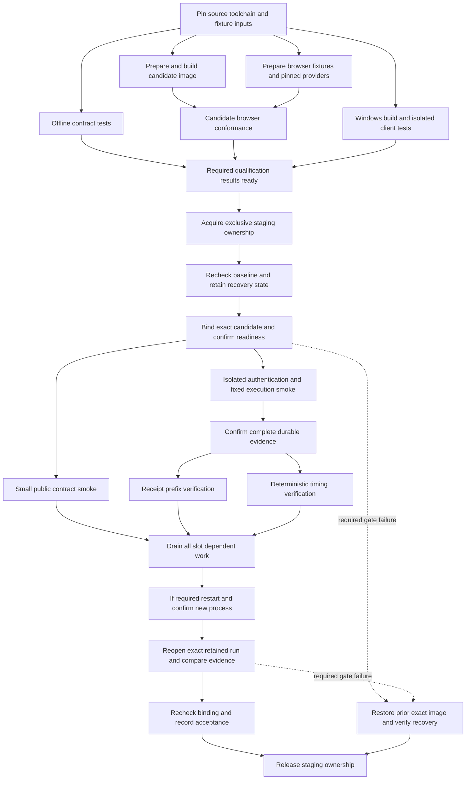

# Staging verification audit and execution order

Audit date: 2026-10-09. Workflow reviewed at `60033d2`.

The deployment workflow combines release safety, component conformance, browser
regressions, live provider availability, documentation captures and performance
qualification. These have different purposes and different dependencies. They
do not all justify blocking every staging deployment or holding the staging
lock. This audit proposes their placement; it does not change the workflow.

A useful assertion can still have a brittle harness. No current green run is
proof that every gate is deterministic. Controlled-input checks should have
deterministic decisions. Live Azure, SQL and model availability checks cannot
promise a deterministic environment and must identify that dependency explicitly.

## Measured deployment

[Run 37919308588](https://github.com/BPMSoftwareSolutions/sfx-platform/actions/runs/37919308588/job/113784641809)
provides the following measurements. Durations are observed for this run, not
service-level budgets or estimates of future performance.

| Work | Observed time | What happened |
| --- | ---: | --- |
| Waiting for the preceding release | 4m15s | The workflow-wide concurrency group also held offline checks and preparation. |
| Checks job | 22s | All 15 verification commands passed; the retained-capture clock check took 3s. |
| Deploy job setup through identity publish | 1m13s | Checkout, tooling, pinned provider/DAL sources, offline browser test and identity compilation. |
| Package, build, lock, bind and verify image | 4m10s | Reading the previous image occupied about 26s; the log does not separately measure ACR build, image locking and slot readiness. |
| Public reads and authorization boundaries | 1m22s | Many sequential HTTP and declared-reader checks. |
| Sign-in, page captures, Observe and sign-out | 2m54s | Page capture bundle took 2m00.7s; the capability execution took 25.114s. |
| Replay checks | 49s, failed | Prefix and deterministic timing checks passed; browser replay timed out waiting for its finished label after 37.279s. |
| Recovery | Completed | The prior exact image was restored at 10:59:46 UTC, or 06:59:46 EDT. |

The completed capability returned `RETURNED` and
`EQUITY_MARKET_PRICE_EVIDENCE_RESOLVED`. Its scenario replay window was 22.279s.
The replay failure is not evidence that the capability or model failed. The
retained replay diagnostic has the timeout but no failed-page state or sampled
frames, so its exact browser cause remains unproven.

Evidence is in the run's `staging-release` and `staging-final` artifacts:
`browser/run.json`, `browser/browser-receipt.json`,
`browser-captures/capture.json`, `replay-timing.json`, `replay-process.json` and
`rollback.json`. The earlier `ADMITTED` versus `RETURNED` failure was separately
confirmed contract drift; it must not be combined with this timeout as one cause.

## Qualification required of every gate

Each gate needs a named owner, the user-visible failure it prevents, the precise
predicate it checks, its trigger, dependency list, runtime budget, failure
classification and retained diagnostic. Qualification requires:

1. **Controlled inputs.** Pin code, toolchain and fixture authority. Declare
   external dependencies. Missing required fixtures fail as configuration errors;
   they cannot silently reduce coverage while reporting success.
2. **A demonstrated failure signal.** A deliberate representative fault must
   fail the specific assertion. Removing a required field, changing a digest,
   crossing a run boundary or exposing a credential are examples. A test that
   only passes the current implementation is not qualified by that fact.
3. **Controlled ordering.** Wait for an observed readiness or protocol condition.
   Use an injectable clock for elapsed-time semantics. Demonstrate behavior under
   delayed startup, delayed delivery, disconnects and scheduler stalls where
   those conditions affect the test. A larger timeout is not this evidence.
4. **Isolation.** Independent ports, temporary directories, browser contexts,
   sessions and exact run IDs. Changing test order or running independent tests
   concurrently must not change their assertions or selected evidence.
5. **Stable observables.** Test published contracts and behavior. Source spelling,
   helper names, incidental DOM text and SVG coordinates are unsuitable proxies
   unless that exact representation is the explicitly required product contract.
6. **Actionable failure evidence.** Preserve stage, expected/actual value,
   relevant run/snapshot IDs, browser errors and bounded page/transport state.
   Distinguish product failure, fixture drift, unavailable dependency and harness
   failure. Retrying until green establishes none of these properties.

Finite repetition can expose flakes; it cannot prove their absence. Qualification
must include the failure and ordering cases above. The assessments below reflect
source inspection and retained run evidence, not a completed new qualification
campaign for every suite.

## Preparation and orchestration

These steps provision inputs or protect the environment. They are not additional
proof of application correctness.

| Current step | Justification and disposition | Dependency and parallelism |
| --- | --- | --- |
| Source checkout and history | Exact revision and release-scope comparison are necessary. Full history is needed only by the release comparison. | Separate workspaces can be prepared concurrently. |
| Node, browser and .NET setup | Tests and identity/CLI artifacts need their runtimes. Versions and dependency locks are inputs to their evidence. Windows currently uses floating `8.0.x`; pin it before claiming reproducible toolchain inputs. | Run per worker; cache by exact toolchain and lockfile keys. |
| Provider and DAL checkout | Needed for real region packages and the identity binary. Keep exact commit pins and check them against `identity-sources.json`. | Independent checkout/preparation; identity build waits for both. |
| Azure OIDC login | Required authorization for staging operations, not a functional test. | Only jobs that access Azure need it. Login does not justify holding the slot lock. |
| Identity publish | Produce the declared identity artifact and inventory its bytes. Rebuilding unchanged pins on every UI change needs a cost justification; a verified artifact keyed by source/toolchain digests could be reused. | Parallel with offline checks after pinned inputs arrive. |
| Composite image preparation and build | Required delivery artifact; verify manifest, binary preservation and content digests. Keep. | Can overlap offline checks using an immutable components image. Before binding, re-read the slot and reject/rebuild if the assumed baseline changed. |
| Workflow concurrency | Mutual exclusion is essential during slot mutation and rollback. Applying it to all offline work is excessive. | Move preparation outside exclusivity; one release transaction owns staging until acceptance or recovery finishes. |
| Evidence uploads | Preserve diagnosis and recovery records. Keep release/recovery evidence; screenshots are a separate artifact class. | Upload immutable completed evidence alongside other work. Acceptance still depends on required evidence being available. |

## Offline verification inventory

All commands below are currently in the `checks` job except the final browser
suite. Their combined current cost is small. The benefit of parallel preparation
is mainly avoiding the staging queue, not launching fifteen separate runners to
save a few seconds.

| Verifier | Failure it should detect | Current strength or gap | Placement and parallelism |
| --- | --- | --- | --- |
| `deploy/staging/policy.test.mjs` | Wrong image, unpinned sources, unauthorized binary changes or unsafe rollback ownership. | Pure predicates with positive and negative cases. Does not itself exercise Azure. | Keep required; independent. |
| `verify-composite-package.mjs` | Missing/misplaced files or incorrect package inventory. | Temporary fixture package and digest assertions; explicitly not live installation evidence. | Keep required; isolated workspace. |
| `verify-identity-session.mjs` | Broken cookie custody, origin checks, session forwarding or revocation transport. | Local fixture services and negative cases; startup polling and child lifecycle still need delay qualification. | Keep required; isolated ports/processes. |
| `verify-timing.mjs` | Wrong receipt timing, rate scaling, pause/resume, sequencing or stalled-clock catch-up. | Injected scheduler, retained real timestamps and damaged-input cases. Good controlled timing basis; not a measurement of CI rendering latency. | Keep required; independent. |
| `verify-run-api.mjs` | Bad admission boundaries, credential forwarding, cursor routing or fragmented SSE handling. | Local upstream fixtures and protocol assertions, without model execution. | Keep required; isolated ports. |
| `verify-objective.mjs` | Incorrect objective request/summary handling and missing UI wiring. | Behavioral request checks are useful. Exact icon coordinates, source spacing and copy regexes are brittle and should be replaced by observable UI behavior. | Retain behavioral checks; independent. |
| `verify-provider-profile.mjs` | Wrong provider reading or an unintended fallback. | Several checks assert source helper names and exact object-spread spelling rather than selection/refusal behavior. Deterministic text matching is still brittle. | Replace those assertions with behavior/contract checks; independent. |
| `verify-view.mjs` | Wrong declared-view binding, host selection or refusal behavior. | Local fixture host; fixed port and inherited environment require isolation and startup tests. | Keep in predeployment conformance; separate worker or unique ports. |
| `verify-region.mjs` | Missing/unsafe declared regions or incorrect provider responses. | Provider invocation coverage is optional when a provider checkout is absent; source regex checks also remain. A green result has different coverage on different machines. | Require pinned providers explicitly; isolate its fixed port. |
| `verify-pages.mjs --fixtures` | Invalid page declarations, unsafe values or incorrect digest/refusal handling. | File fixtures isolate estate state; fixed port and environment inheritance need tightening. | Keep in predeployment conformance; isolated worker. |
| `verify-components.mjs` | Declared component roles/properties are silently ignored or rendered incorrectly. | Consumption probes are valuable. The DOM shim is not browser proof, and a 20ms settling wait needs an explicit completion condition. | Component conformance; independent with isolated globals. |
| `verify-claims.mjs --fixtures` | Invalid claim vocabulary, provenance or freshness rules. | File-only fixture validation; explicitly does not prove enforcement in live publishing/rendering. | Run with claim/rule/validator changes; independent. |
| `verify-kind-tooling.mjs` | Broken component/reader scaffolding. | Temporary generated artifacts and local command checks; does not exercise the deployed application. | Developer-tool qualification, triggered by generator/template changes; independent. |
| `verify-run-scoped-sse.mjs` | Cross-run leakage, wrong cursor replay or accidental replay on live subscriptions. | High-value protocol assertions, but 300ms startup and 150ms quiet-window sleeps are not readiness/barrier proofs. | Keep after replacing timing assumptions; isolated observer. |
| `verify-observer-bridge.mjs` | Overlapping runs become mixed or testimony is altered by the bridge. | Local fixture supervisor and exact attribution checks; timer-driven interleaving needs controlled-order coverage. | Keep required for bridge/host changes; isolated processes/ports. |
| `verify-run-evidence-browser.mjs` | Wrong run history, evidence, retry, sign-in recovery or duplicate execution after errors. | Pinned region packages and retained evidence; recent repairs demonstrate missing-fixture and mount-order sensitivity. One successful run is insufficient qualification. | Offline browser job before staging mutation; parallel with other offline suites. |

Paths without a directory in this table are under `live-circuit/circuit/`, except
`verify-kind-tooling.mjs` under `tools/live-circuit/`,
`verify-run-scoped-sse.mjs` under `live-circuit/dispatch-pair/`, and
`verify-observer-bridge.mjs` under `deploy/sda-kernel/`.

## Environment verification inventory

The current `public`, `browser`, `replay`, `durable`, `external` and `cli` modes
are in [accept.mjs](../deploy/staging/accept.mjs). A step containing unrelated
assertions must be split before it can have a useful gate contract.

| Current check | Why it exists | Qualification and proposed placement | Parallelism |
| --- | --- | --- | --- |
| Image binding, running manifest, preserved binaries and vault | Prevent deploying the wrong thing, overwriting another release or losing installed state. | Essential release transaction. Exact identities/digests justify the predicate; Azure availability remains an operational dependency. | Build first; baseline recheck, bind and readiness are ordered and exclusive. |
| Public routes, protected endpoints and declaration reads | Catch broken routing, missing installed packages and exposed protected operations. | Keep a small deployed contract smoke. Move exhaustive route retirement and declaration/refusal matrices to fixture/candidate conformance; live estate declarations must have explicit snapshot identity. | Independent reads can use bounded concurrency after readiness. Reads that emit kernel observations must not overlap the current capture harness until exact run correlation is established; all must stop before restart. |
| Real browser sign-in, refusal, cookie and sign-out | Validate the actual identity integration and browser boundary. | Keep a narrow smoke with its own session and semantic state assertions. Negative protocol permutations belong primarily in controlled tests. | Independent of anonymous public reads. Login, use and revocation of one session are ordered. |
| Signed-out/in desktop/mobile home, crosswalk, seven specimen pages, provider views and DOM safety | Detect rendering and content-safety regressions. | Safety assertions are valuable. Exhaustive live-estate screenshots do not justify two minutes inside every authentication gate. Qualify against controlled declarations, and retain live presentation captures separately when relevant. | Independent pages/contexts can be bounded-parallel; session setup precedes signed-in captures. |
| Objective-v3 live Observe with Gemini and market data | Prove a complete real provider journey. | Useful integration evidence, but model choice, external service availability and mutable declarations make this unsuitable as deterministic platform acceptance. Use an approved fixed, side-effect-free execution fixture for the platform smoke; retain the real provider journey as separately classified integration qualification. Fixture authority belongs in sfx-embody. | Requires its own admitted run and session. Do not overlap with other live executions until every observer/capture path correlates by exact run ID. |
| Live provider/operation/outcome painting | Prove the browser follows actual execution. | Useful integration assertion, but frame sampling can miss short transitions and depends on the renderer scheduler. Test receipt semantics and controlled scheduling separately; keep a bounded UI smoke with actionable failure state. | Depends on its own execution; never restart beneath it. |
| Complete SQL capture and before-restart hashes | Prove execution evidence is durably retained before testing recovery. | Required for a persistence contract; explicit completion and byte/digest checks are strong predicates. SQL availability is an external dependency. | After execution; independent reads of that completed run can run together. |
| Azure logstream sample and secret scan | Detect disclosure in actual host output. | Disclosure detection is important, but requiring SCM log availability and a startup marker in a bounded sample can fail independently of credential handling. Use controlled redaction tests as required checks; classify live log transport and sampling coverage separately. | Collection can overlap the smoke; bounded shutdown and cleanup are required. |
| Every retained receipt prefix | Detect impossible or misattributed live state from actual evidence. | Pure processing of the capture; useful, with an exact scene/run input. | After capture closes; parallel with deterministic timing and read-only analysis. |
| All replay rates on the fresh capture | Check current evidence maps onto timing/ordering rules. | Deterministic scheduler passed in this run. Keep separate from claims about browser wall time. | After capture closes; parallel with prefix verification. |
| 1x real-browser replay | Verify renderer integration with retained receipts. | Current timeout is unexplained and lacks failed-page state. Not qualified yet. Replay selection/reconnect lifecycle and event ordering need a reproducible test before claiming reliability. Prefer candidate browser qualification using pinned retained evidence. | Parallel with pure capture analysis only when served code and scene are fixed; no slot restart during the test. |
| Explicit process restart and unchanged vault | Detect ephemeral state or a wrong process/image after restart. | Strongly justified for storage, startup, image and delivery changes; justify running it for every presentation-only change. A restart is destructive to concurrent sessions/tests even though the data check is read-only. | Exclusive barrier: all slot-dependent work must drain first. |
| Same owner reopens the same run after restart | Detect lost evidence, ownership errors or accidental re-execution. | Exact event/graph/output equality and zero new admissions are useful. Browser copy/DOM assertions are additional coupling. | Strictly after complete pre-restart capture and confirmed new process. |
| API CLI invocation plus anonymous live following after restart | Exercise a second authentication/client path and external observation. | Distinct transport coverage is useful; a second Gemini/market request is unnecessary for that contract. Use the same approved deterministic fixture with a new exact run ID. | CLI submission and its follower are coordinated. Can overlap independent session checks only after run isolation is established. |
| Windows hidden prompt, cancellation, DPAPI, whoami/logout and redirected-input refusal | Catch Windows client credential and terminal regressions. | Valuable when CLI, installer, input provider or identity/host contracts change. A full Windows toolchain and live login suite on unrelated UI edits needs justification; current floating SDK weakens reproducibility. | Build and local PTY tests before deployment, parallel with Linux work. Live authentication requires deployed readiness and isolated sessions; cannot cross restart. |
| Final accepted-release receipt | Prevent declaring success for an obsolete binding or incomplete required evidence. | Keep, but the receipt should list qualified gate IDs and artifact digests rather than infer broad proof from job success. | After required gates; recheck exact image and health while still owning the slot. |
| Rollback | Restore the prior known image after a candidate fails the required release contract. | Essential. Verify ownership, exact prior digest and recovery readiness; distinguish successful rollback from the intentionally failed release status. | Exclusive failure branch; finish before releasing the slot lock. |

## Proposed dependency graph

The parallel environment lanes below require qualified run/session isolation.
Until then, keep observation-producing readers and live executions ordered;
this graph is not an instruction to parallelize the existing harness unchanged.

The failure branch applies to every stage after mutation, not just the two
arrows drawn. When restart qualification is not required by the change scope,
the drained transaction proceeds directly to final binding checks. Required
live Windows/client checks must join the drain barrier before a restart; pure
client qualification belongs before environment ownership. Additional qualified
post-restart client checks precede final acceptance.

Live model/provider journeys, exhaustive presentation captures and wall-clock
performance qualification need separate results and explicit owners. If they
share staging, they still must coordinate with the same ownership mechanism;
moving them to another workflow does not make simultaneous restarts safe.

## Conditions for safe parallel execution

- **Safe now with isolated workers:** pure policy/package/clock checks, fixture
  contract tests, pinned dependency preparation, identity/CLI compilation and
  artifact processing. Use independent output directories and ports. The fixed
  ports in several current tests rule out blindly running every script in the
  same host process namespace.
- **Safe after readiness with bounded concurrency:** anonymous independent
  public reads. Pin the expected declaration snapshot so a concurrent estate
  edit is reported as changed input rather than a product failure. Declaration
  readers can themselves emit kernel observations; do not overlap those reads
  with the current global capture parser until it is scoped to the exact run.
- **Requires refactoring first:** live browser Observe, API CLI execution and
  global-observer capture. Current browser/CLI followers and replay selection
  include latest-run/graph selection and sequential capture grouping. Correlate
  every receipt, output, browser state and assertion with the admitted run ID;
  prove interleaved same-capability runs remain separate.
- **Always ordered within one test:** login then use then revoke; admission then
  completion then durable snapshot; pre-restart evidence then restart then
  readback; image construction then binding then readiness.
- **Always exclusive on staging:** baseline ownership check and mutation,
  configuration writes, restart, final acceptance/binding checks and rollback.
  Hold one coherent transaction lock through recovery, rather than separate job
  locks that leave gaps between deployment, Windows checks and finish.

## Changes needed before claiming the gates are qualified

1. Replace source-format assertions and sleep-based readiness with behavioral
   checks and explicit barriers. Require pinned provider fixtures and toolchains.
2. Reproduce the replay timeout with retained inputs, retain failed browser state
   and test delayed/disconnected transports. Its exact cause is not established
   by the existing artifact; do not relabel it an application failure or simply
   raise the timeout.
3. Define the narrow platform smoke and approve its deterministic capability
   fixture through the owning repository. Split exhaustive presentation and
   real-model qualification from this contract.
4. Move independent checks/builds outside staging exclusivity. Introduce an
   explicit join and one complete environment transaction, with baseline
   revalidation before mutation.
5. Require exact run/session attribution before parallelizing live clients.
   Then add controlled delay, disconnect and overlap cases for the harnesses
   that will run concurrently.
6. Retain per-stage duration and classified diagnostics. A release report must
   distinguish tested behavior, omitted scope, unavailable infrastructure and
   failed test machinery; no green job should imply optional checks ran.

## Implementation status, 2026-10-09

The workflow has since been reorganized along this audit; the sections above
remain the audit as written. Current behavior is in
[automatic-staging-deployment.md](automatic-staging-deployment.md). Each
numbered change above:

1. **Done for the named suites.** `verify-objective.mjs` and
   `verify-provider-profile.mjs` no longer match icon geometry, copy, helper
   names or spread spelling: they test admission, reader selection, selection
   binding and served routes by behavior, and the offline browser test now
   clicks a provider and submits an objective. `verify-run-scoped-sse.mjs` waits
   for `/health` and for an explicit `: replay-complete` boundary that the
   observer writes; injected faults (bare replay, run-window leak) fail it.
   `verify-components.mjs` awaits render completion instead of 20 ms. The region
   gate requires the pinned providers and its blueprint comparison runs only on
   request. Fixed ports are gone and fixture observers get an isolated
   environment; all fifteen offline gates passed fully concurrent three times.
   Windows .NET is pinned to 8.0.408, and provider pins are read from
   `identity-sources.json` and `client-sources.json`. *Open:* source checks
   remain in `verify-region.mjs` and `verify-view.mjs`; startup-delay and
   child-lifecycle qualification of `verify-identity-session.mjs` and
   `verify-observer-bridge.mjs` was not performed.
2. **Done.** The timeout was reproduced from run 37919308588's retained scene
   and capture and traced to an Explorer stream race (a stale reconnect closed
   the replay stream mid-delivery). The runtime is fixed, the browser replay now
   runs on the candidate with a deterministic delayed-delivery case that the
   pre-fix runtime fails, and failures retain page and stream state.
3. **Partly done.** The deployment smoke, a post-acceptance presentation job and
   a pure-processing evidence gate replace the old public, capture and replay
   steps. *Open:* no deterministic execution fixture exists; one must be
   approved through `sfx-embody`. Until then the objective-v3 Gemini and
   market-data journey remains the required execution path, and every receipt
   states that it is not deterministic and names its dependencies.
4. **Done.** Offline gates, candidate browser qualification, Windows client
   tests and the identity build run in `staging-checks.yml` outside the lock.
   One release run holds the lock through acceptance or rollback. Baseline
   recheck before PATCH is retained, and a commit not descending from the
   installed source is refused. The image build stays inside the transaction
   because its components image is the currently bound baseline.
5. **Not started.** Live browser Observe, the CLI follower and global capture
   remain strictly ordered.
6. **Done.** Every offline and staging gate records its duration and result;
   classification is reported only from explicit evidence. The acceptance
   receipt lists required gates, omitted scope with reasons (the Windows client
   gate when out of scope, an unavailable live log sample) and evidence digests.

A new finding qualifies the read-concurrency rule above. Overlapped provider
inspections against staging failed with `CIRCUIT_READER_UNAVAILABLE`: the host
allows two concurrent reads with a 30 s retrieval timeout, and each inspection
takes about 20 s alone. Only static reads run in parallel; reader-backed reads
remain sequential.

## Source references

- [Workflow and current concurrency scope](../.github/workflows/staging.yml)
- [Release mutation and recovery](../deploy/staging/release.mjs)
- [Acceptance assertions](../deploy/staging/accept.mjs)
- [Final receipt](../deploy/staging/finish.mjs)
- [Browser session gate](../tools/live-circuit/verify-browser-session.mjs)
- [Presentation capture bundle](../tools/live-circuit/browser-captures.mjs)
- [Browser replay harness](../tools/sfx-api/verify-circuit-replay.mjs)
- [Deterministic replay checks](../live-circuit/circuit/verify-timing.mjs)
- [Exact stored-run comparison](../tools/live-circuit/durable-snapshot.mjs)
- [External CLI follower](../tools/live-circuit/verify-external-live.mjs)
- [Windows client qualification](../tools/sfx-api/live-auth-test.mjs)
- [Objective source assertions](../live-circuit/circuit/verify-objective.mjs)
- [Provider-view source assertions](../live-circuit/circuit/verify-provider-profile.mjs)
- [Optional region coverage](../live-circuit/circuit/verify-region.mjs)
- [SSE startup and quiet-window waits](../live-circuit/dispatch-pair/verify-run-scoped-sse.mjs)
